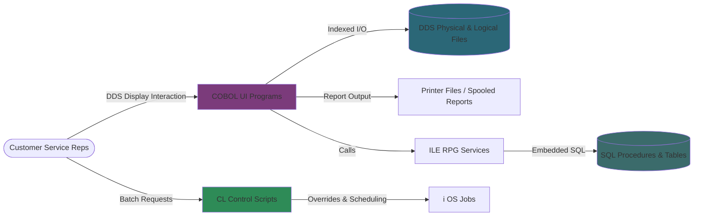

# System Overview

## System Identity and Purpose
The CobolDemo CRM and order management system supports customer master maintenance, contract lifecycle management, transaction history inquiry, and distribution tracking across mixed COBOL, RPG, CL, and DDS assets on IBM i. It integrates interactive display files with database access paths to guide call-center and back-office staff through daily operations.

## Business Context
The system mirrors a mid-market supply and service organization. Core responsibilities include maintaining customer demographics, capturing contract headers and details, managing sales representative assignments, and producing audit or follow-up reports. Batch utilities complement interactive maintenance by preparing printer output and summary extracts used by supervisors and downstream analytics teams.

## Architecture Summary
- **Presentation Layer:** DDS display files (e.g., `WCUSTSD`, `WCONDETD`, `CUSFMAINTD`) rendered through COBOL and RPGLE programs for interactive screens.
- **Business Logic:** COBOL programs (`ZBCONDET`, `ZBCONHDR`, `ZBCUSTS`, etc.) orchestrate validation, CRUD, and report routines, while RPG/RPGLE modules provide complementary inquiries and service stubs.
- **Data Access:** DDS physical/logical files (`CUSTS`, `CONHDR`, `CONDET`, `TRNHST`, `STKMAS`, `ORDSTS`, `SLMEN`) define storage. Copybooks align COBOL data structures with DDS layouts, and SQL artifacts provide modernization hooks.
- **Control Layer:** CL programs manage overrides, printer/file setup, and job control for nightly or on-demand processing. Custom commands launch key workflows.

## System Context Diagram

## Key Inputs and Outputs
- **Inputs:** Interactive keystrokes via display files, DDS physical files (`CUSTS`, `CONHDR`, `CONDET`, `TRNHST`), logical views (e.g., `CUSFL3`), and reference master tables (`SLMEN`, `ORDSTS`, `DISTS`).
- **Outputs:** Updated contract and customer records, printer spools (customer follow-up lists, contract detail reports), confirmation messages, and data prepared for downstream SQL modernization layers.
