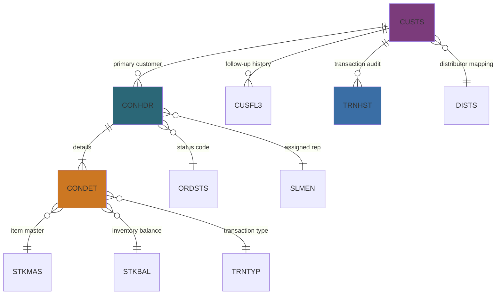

# Data Model

## Logical Data Structure

## Entity Summaries
- **CUSTS:** Customer master including contact, geographic, hierarchy, and credit exposure attributes used across interactive programs and reports.
- **CONHDR:** Contract header keyed by contract number (`XWORDN`) with customer, sales representative, and status references.
- **CONDET:** Contract line detail keyed by contract number plus item (`XWABCD`), storing item descriptions, pricing text, and delivery expectations.
- **TRNHST:** Transaction history lines displayed in inquiry programs and printers, providing chronological audit of customer activity.
- **Reference Tables:** `SLMEN` (sales representatives), `ORDSTS` (order status descriptions), `TRNTYP` (transaction types), `DISTS` (distributor codes), and `CUSGRP` (customer grouping) provide controlled vocabularies.

## Key Relationships
1. Each `CONHDR` row belongs to one `CUSTS` row via the customer code; multiple contract headers may exist per customer.
2. Each `CONDET` row belongs to one `CONHDR` contract and references item master (`STKMAS`) and branch inventory (`STKBAL`, `STOMAS`).
3. Customer follow-up file `CUSFL3` aggregates contact and reminder notes for each customer, linking to CL and reporting utilities.
4. Sales representatives (`SLMEN`) and order statuses (`ORDSTS`) ensure consistent validation during contract maintenance.

## Data Dictionary
| Element | Type | Source | Description |
| --- | --- | --- | --- |
| `XWORDN` | Packed (contract number) | `CONHDR`, `CONDET` | Primary contract identifier validated against header existence. |
| `XWBCCD` | Char (customer code) | `CUSTS`, `CONHDR`, `CUSFL3` | Customer master key shared across modules and copybooks. |
| `PERSON` | Char (sales rep) | `CONHDR`, `CUSTS`, `SLMEN` | Sales representative ID driving lookups into sales master. |
| `XWSTAT` | Char (status) | `CONHDR`, `ORDSTS` | Order/contract status value tied to descriptive text. |
| `XWABCD` | Char (item code) | `CONDET`, `STKMAS`, `STKBAL` | Stock keeping unit referenced by contract detail lines. |
| `CUSNO` | Zoned numeric | `CUSFL3` | Sequential follow-up reference enforcing positive values. |
| `DSDCDE` | Char (distributor) | `CUSTS`, `DISTS` | Distributor assignment validated during customer maintenance. |
| `ZWIDV0` | Packed | `CUSTS` | Customer outstanding balance compared with credit limit totals. |

## Modernization Observations
- SQL DDL equivalents exist under `QSQLSRC`, providing a path to migrate DDS physical files into SQL tables while retaining legacy logical file semantics through views or indexes.
- Copybooks in `CPYBKSRC` mirror DDS record layouts; automated regeneration or API-based payload definitions would reduce duplication and ease integration with external services.
