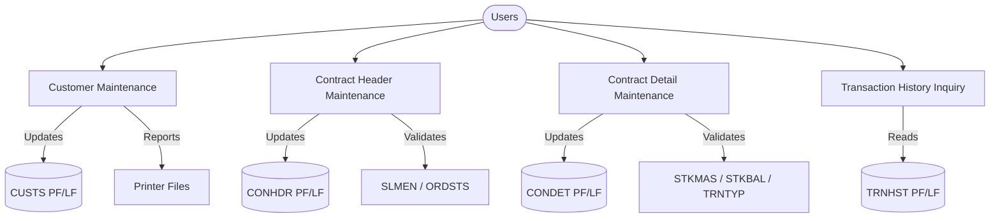

# Process Model

## Level 0 Overview

## Customer Maintenance (`ZBCUSTS`)
- **Purpose:** Manage customer demographics, sales assignments, distributors, and follow-up metrics.
- **Inputs:** Display subfile selections, lookup prompts, DDS logical files (`CUSFL3`, `CUSGRP`), and reference masters (`SLMEN`, `DISTS`).
- **Outputs:** Updated customer master (`CUSTS`) and confirmation/printer messages; navigation to order and history programs.
- **Processing:** Two-page maintenance screen handles identity fields (page 1) and financial/volume metrics (page 2). Validation routines enforce presence of customer name, existing groups, valid sales reps, distributor codes, and positive follow-up numbers.

## Contract Header Maintenance (`ZBCONHDR`)
- **Purpose:** Create and edit contract headers including sales representative, status, and core customer linkages.
- **Inputs:** Customer selections, contract prompts, and reference validations for statuses and representatives.
- **Outputs:** Header updates to `CONHDR`, message text via `RTNMSGTEXT`, and optional cascade deletes when F23 is triggered.
- **Processing:** Display driver coordinates change/add/delete actions. Validation prevents duplicate contract numbers during addition and rejects unknown customers, statuses, or reps. Prompt routines call selector programs for each domain.

## Contract Detail Maintenance (`ZBCONDET`)
- **Purpose:** Maintain contract line items and produce printable detail reports.
- **Inputs:** Subfile selections (change/delete/display), item master lookups, and status references from header context.
- **Outputs:** Updated `CONDET` rows, recalculated subfiles, printer spool `CONDET-REPORT`, and interactive messages.
- **Processing:** Initialization loads customer, representative, and status descriptions from header and reference files. Validation ensures contract numbers are non-zero, unique on add, and associated customer/status/rep exist. Additional checks confirm reference table presence before accepting edits.

## Transaction History (`ZBTRNHST`)
- **Purpose:** Provide chronological view of customer transactions and optionally print history.
- **Inputs:** Customer selection from `ZBCUSTS` or `ZBCONHDR`, keyed access to `TRNHST` logical files, and user filter criteria.
- **Outputs:** Displayed history subfiles and optional printer output for audits.
- **Processing:** Batch-style read loops load subfiles with transaction records, enabling inquiry navigation and spool generation for offline review.
