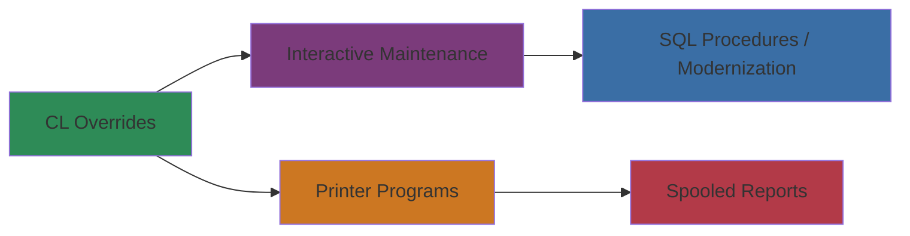

# Physical Design

## Runtime Environment
- IBM i environment with COBOL/400, RPG, and CL components compiled from corresponding source physical files.
- Library lists prepared by CL programs ensure DDS and copybooks are accessible during execution.
- Display files run in interactive subsystems, while printer programs execute as batch jobs producing spooled output.

## File Organization
- **DDS Physical Files:** Indexed by primary and secondary keys (e.g., `CONHDR` keyed by contract number; `CONDET` keyed by contract and item).
- **Logical Files:** Provide alternative access paths such as `CUSFL3` for follow-up sequencing and `TRNHST` logicals for chronological history.
- **Printer Files:** Configured for 132-column output and used by COBOL reports to format detail and summary listings.

## Batch Flow

## Deployment Considerations
- **Scheduling:** Nightly or on-demand CL jobs submit printer programs and data refresh tasks. Overrides must be reset before each run.
- **Data Synchronization:** Copybooks must match DDS definitions; recompilation required after schema changes.
- **Modernization Hooks:** SQL procedures and RPGLE modules can be deployed as service programs, exposing REST or message-based APIs while legacy COBOL continues to operate.

## Performance Notes
- Heavy use of indexed DDS access ensures efficient retrieval; subfile pagination limits interactive load.
- Validation routines minimize disk I/O by checking reference masters before writing.
- Printer programs sequentially read logical files to generate summary totals, allowing future replacement with SQL-based reporting engines.
