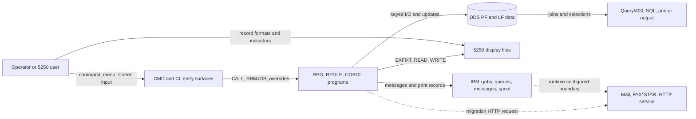
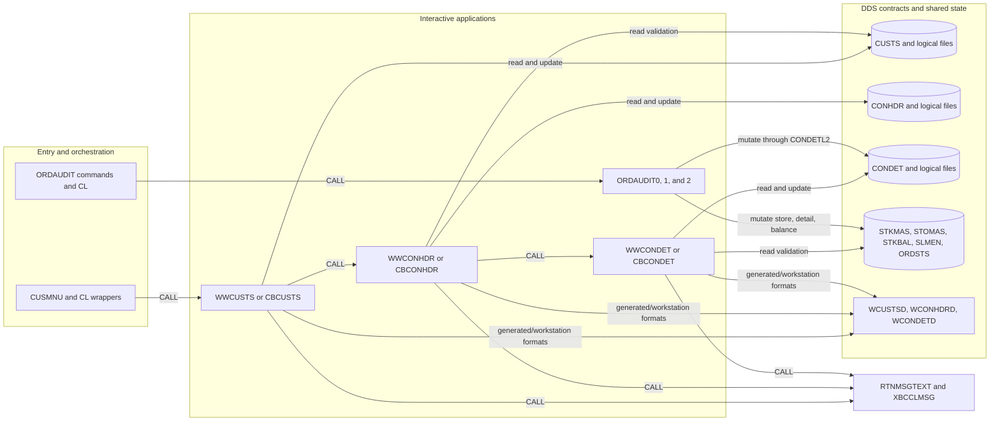
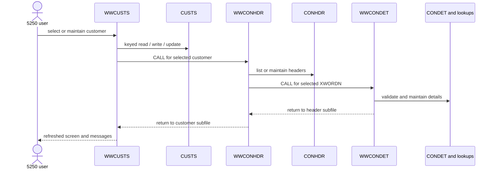
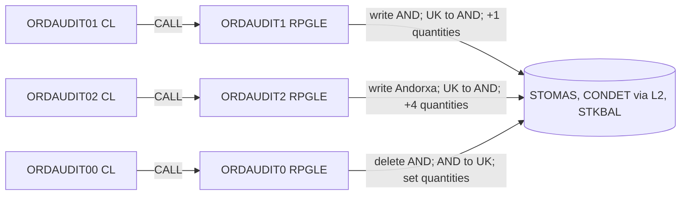
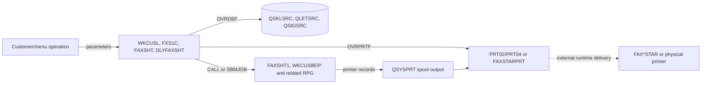
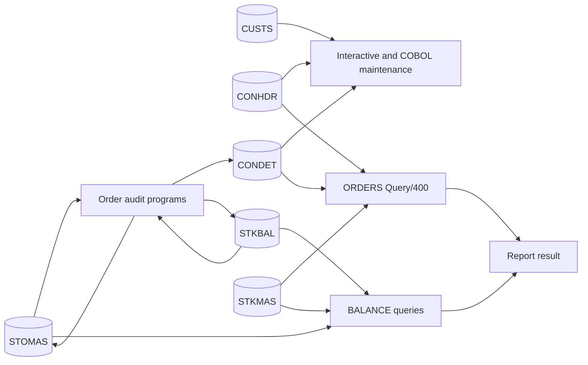

# Architecture, Execution Flows, and Subsystem Interactions

## Snapshot, scope, and evidence rules

This reconstruction describes tracked repository state at commit
`012677192caa66e54fd72191bb3b2afafb8b3402`, inspected on 2026-07-14. The
[archaeology evidence map](00-evidence-map.md) is the coverage baseline. This
document adds relationship and flow analysis; it does not replace that tracked
inventory or establish which objects are compiled, scheduled, or deployed.

Evidence labels are used throughout:

- **Fact** — directly visible in a tracked primary member or reproducible Git
  inventory. A primary path is supplied.
- **Inference** — a bounded interpretation supported by cited facts, but not
  explicit about intent, chronology, ownership, or runtime use.
- **Unknown** — the repository cannot decide the claim. The evidence needed to
  resolve it is stated.

Interaction classes have precise meanings:

- **Static call** — a source member explicitly calls another program or API.
- **Shared-data coupling** — components read or change the same database,
  display, printer, queue, or message state without a direct call between them.
- **Generated linkage** — source consumes a record or screen layout generated
  from DDS at compile time.
- **Configured/runtime integration** — a relationship is established through
  library lists, overrides, job configuration, queues, environment variables,
  HTTP, or another runtime facility.
- **Inference** — a plausible edge lacks enough primary evidence to classify as
  one of the confirmed mechanisms above.

The diagrams deliberately use solid arrows for source-confirmed relations and
dashed arrows for inferred or runtime-unverified relations. "Configured" on a
solid arrow means the configuration instruction is a fact; it does not prove
that the referenced external object exists in a deployed environment.

## System context

The repository is a mixed IBM i customer, contract/order, stock, reporting,
and operational-communications system with a later HTTP migration experiment.
The durable center is not a single application service: programs coordinate
through DDS files, record formats, 5250 workstations, calls, overrides, jobs,
message queues, and spool output.

**Evidence.** Entry and operational surfaces are represented by
`QCMDSRC/*.CMD`, `QCLSRC/*.CLP`, and `QCLLESRC/*.CLLE`; procedural code is in
`QCBLSRC`, `QRPGSRC`, and `QRPGLESRC`; DDS contracts are in `QDDSSRC`; report
surfaces are in `QQMQRYSRC`, `QSQLPRC`, `QSQLSRC`, and printer DDS; and the HTTP
experiment is under `docs/migration/`. Whether FAX*STAR, mail transport, Db2
HTTP support, or the HTTP service is available is **Unknown** without deployed
object/configuration and runtime trace evidence.

## Principal subsystems and responsibilities

| Subsystem | Responsibilities and entry points | Primary evidence | Status and boundary |
| --- | --- | --- | --- |
| Operator commands and menus | Prompt audit parameters, expose transaction-history entry, route menu choices, inspect jobs/queues/writers | `QCMDSRC/ORDERAUDIT.CMD`, `QCMDSRC/ORDAUDIT0.CMD`, `QCMDSRC/TRNHSTCMD.CMD`, `QCLSRC/CUSMNU.CLP` | **Fact.** Command-to-processing-program binding is not present in the CMD source and remains runtime/build metadata **Unknown**. |
| CL/CLLE orchestration | Call programs, apply database/printer overrides, submit work, manipulate library lists, send messages, and direct spool output | `QCLSRC/ORDAUDIT00.CLP`, `QCLSRC/DLYFAXSHT.CLP`, `QCLSRC/FXS1C.CLP`, `QCLSRC/WKCUSL.CLP`, `QCLSRC/XBCCLMSG.CLP`, `QCLSRC/RTNMSGTEXT.CLLE` | **Fact** for statements in source; actual libraries, queues, job descriptions, and message files are runtime **Unknowns**. |
| Interactive customer maintenance | Display/search/create/update/delete customers and navigate to their contracts and transaction history | `QRPGLESRC/WWCUSTS.RPGLE`, `QDDSSRC/WCUSTSD.DSPF`, `QDDSSRC/CUSTS.PF` | **Fact.** `WWCUSTS` calls `WWCONHDR` and `WWTRNHST`; which variant is deployed is **Unknown**. |
| Interactive contract/order maintenance | Maintain contract headers and details, validate customer/status/product/store data, and use subfiles and message queues | `QRPGLESRC/WWCONHDR.RPGLE`, `QRPGLESRC/WWCONDET.RPGLE`, `QDDSSRC/WCONHDRD.DSPF`, `QDDSSRC/WCONDETD.DSPF` | **Fact.** Source names say contract while Query/400 calls the same header/detail records orders; exact domain terminology belongs in the domain audit. |
| COBOL maintenance family | Implement parallel customer, header, detail, and transaction-history screens using DDS-generated copy layouts | `QCBLSRC/ZBCUSTS.CBL`, `QCBLSRC/ZBCONHDR.CBL`, `QCBLSRC/ZBCONDET.CBL`, `QCBLSRC/ZBTRNHST.CBL` | **Fact.** Filenames differ from `PROGRAM-ID` values (`CBCUSTS`, `CBCONHDR`, `CBCONDET`, `CBTRNHST`), creating build/object-name coupling. |
| Tracked COBOL copybooks | Define reusable customer follow-up, group, customer-master, and distribution layouts | `CPYBKSRC/CUSFL300.CBLINC`, `CUSGRP00.CBLINC`, `CUSTS00.CBLINC`, `DISTS00.CBLINC` | **Fact.** No matching `COPY` use of these four member names occurs in tracked `.CBL` sources; compiled consumers or generation/synchronization rules are **Unknown**. They are distinct from the explicit `COPY DDS-*` forms. |
| Order-audit batch | Run three discrete mutation steps over stores, order details, and stock balances | `QCLSRC/ORDAUDIT00.CLP` through `ORDAUDIT02.CLP`; `QRPGLESRC/ORDAUDIT0.RPGLE` through `ORDAUDIT2.RPGLE` | **Fact.** Schedule, intended sequence, restart rules, commitment control, and production use are **Unknown**. |
| Reporting and query | Join customer/order/product or store/stock data; print customer, stock, order, fax, and letter layouts | `QQMQRYSRC/ORDERS`, `QQMQRYSRC/BALANCEPRD`, `QQMQRYSRC/BALANCESTO`, `QDDSSRC/*.PRTF`, fixed-format report programs in `QRPGSRC` | **Fact** for query text and tracked layouts. Active report schedule and consumer are **Unknown**. |
| Shared messages | Resolve message text and clear/send program messages used across RPG/COBOL screens | `QCLSRC/RTNMSGTEXT.CLLE`, `QCLSRC/XBCCLMSG.CLP`, call sites in `QCBLSRC` and `QRPGLESRC` | **Fact.** Message-file availability and queue state are configured/runtime concerns. |
| Fax and letter operations | Build letter source, submit jobs, override printer/database files, route spool output to printer queues or FAX*STAR | `QCLSRC/DLYFAXSHT.CLP`, `QCLSRC/FAXSHT.CLP`, `QCLSRC/FXS1C.CLP`, `QCLSRC/WKCUSL.CLP`, `QRPGSRC/FAXSHT1.RPG` | **Fact** for orchestration; external FAX*STAR installation and successful delivery are **Unknown**. |
| SQL and modernization samples | Define a country table/data, demonstrate stored procedures and embedded SQL, and prototype an external concat service | `QSQLSRC`, `QSQLPRC`, `QRPGLESRC/*.SQLRPGLE`, `docs/migration/` | **Fact** for tracked sources. Production reachability and deployment are **Unknown**. |
| Ad hoc test/tutorial material | Preserve mixed RPG/CL/DDS examples and test-named SQLRPGLE/prototype members | `ASIMPLTEST/TUTR001.RPG`, `QRPGLESRC/TSTPGM*.SQLRPGLE`, `QDDSSRC/TSTPF*` | **Fact.** These are clues, not an automated regression harness. |

## Component and dependency structure

The diagram groups parallel RPGLE and COBOL implementations because they touch
the same DDS object families. It does **not** assert that both implementations
are active together. The exact command/menu route to each implementation and
the active object variants require compile/deployment metadata or runtime
traces.

## Classified interaction-edge catalog

The table concentrates the material edges used by the representative flows.
It is not a claim that suffix- and parser-limited tooling found every IBM i
dependency.

| Source -> target | Direction and mechanism | Payload or shared data | Class | Evidence | Primary path/member |
| --- | --- | --- | --- | --- | --- |
| `WWCUSTS` -> `WWCONHDR` | direct `CALL` | customer number in shared program fields | Static call | **Fact** | `QRPGLESRC/WWCUSTS.RPGLE` |
| `WWCONHDR` -> `WWCONDET` | direct `CALL` | selected `XWORDN` order/contract context | Static call | **Fact** | `QRPGLESRC/WWCONHDR.RPGLE` |
| `CBCUSTS` -> `CBCONHDR` | COBOL `CALL ... USING` | `XWBCCD` customer key | Static call | **Fact** | `QCBLSRC/ZBCUSTS.CBL` |
| `CBCONHDR` -> `CBCONDET` | COBOL `CALL ... USING` | `XWORDN` order/contract number | Static call | **Fact** | `QCBLSRC/ZBCONHDR.CBL` |
| RPGLE maintenance -> DDS displays | workstation file plus record-format I/O (`EXFMT`, `WRITE`, subfiles) | screen fields, function-key indicators, subfile records, message queue keys | Generated linkage | **Fact** | `QRPGLESRC/WWCUSTS.RPGLE`, `WWCONHDR.RPGLE`, `WWCONDET.RPGLE`; paired `QDDSSRC/W*.DSPF` |
| COBOL maintenance -> DDS displays | `ASSIGN TO WORKSTATION-*` and `COPY DDS-*` | generated input/output record layouts and indicators | Generated linkage | **Fact** | `QCBLSRC/ZBCUSTS.CBL`, `ZBCONHDR.CBL`, `ZBCONDET.CBL` |
| COBOL maintenance -> DDS PF records | `COPY DDS-<format> OF <file>` plus file I/O | `CUSTSR`, `CONHDRR`, `CONDETR`, lookup record formats | Generated linkage | **Fact** | the three COBOL members above and `QDDSSRC/*.PF` |
| `WWCUSTS` / `CBCUSTS` -> `CUSTS` | keyed read and mutation | customer master keyed by `XWBCCD` | Shared-data coupling | **Fact** | `QRPGLESRC/WWCUSTS.RPGLE`, `QCBLSRC/ZBCUSTS.CBL`, `QDDSSRC/CUSTS.PF` |
| header maintenance -> `CONHDR` | keyed read and mutation | header keyed by `XWORDN`; customer/status/reference fields | Shared-data coupling | **Fact** | `QRPGLESRC/WWCONHDR.RPGLE`, `QCBLSRC/ZBCONHDR.CBL`, `QDDSSRC/CONHDR.PF` |
| detail maintenance -> `CONDET` | keyed read and mutation | detail keyed by `XWORDN` + `XWABCD`; store and quantity/price fields | Shared-data coupling | **Fact** | `QRPGLESRC/WWCONDET.RPGLE`, `QCBLSRC/ZBCONDET.CBL`, `QDDSSRC/CONDET.PF` |
| `CONHDRL1` -> `CONHDR` and `CONDETL2` -> `CONDET` | DDS `PFILE` access paths | alternate keyed ordering over base records | Generated linkage | **Fact** | `QDDSSRC/CONHDRL1.LF`, `QDDSSRC/CONDETL2.LF` |
| maintenance programs -> `RTNMSGTEXT` / `XBCCLMSG` | program calls | message ID/text and program-message-queue state | Static call | **Fact** | call sites in `QCBLSRC/ZBCONHDR.CBL`, `QRPGLESRC/WW*.RPGLE`; targets in `QCLSRC` |
| `ORDAUDIT00/01/02` -> `ORDAUDIT0/1/2` | CL `CALL PGM(...)` | no explicit parameters | Static call | **Fact** | matching members in `QCLSRC` and `QRPGLESRC` |
| `ORDAUDIT0/1/2` -> `STOMAS`, `CONDET(L2)`, `STKBAL` | keyed RPG file I/O and updates | store codes, product keys, quantities, and store reassignment | Shared-data coupling | **Fact** | `QRPGLESRC/ORDAUDIT0.RPGLE` through `ORDAUDIT2.RPGLE` |
| Query/400 `ORDERS` -> `CONHDR`, `CONDET`, `STKMAS` | read-only join | customer, order, product, quantity, price, computed `NETVAL` | Shared-data coupling | **Fact** | `QQMQRYSRC/ORDERS` |
| Query/400 balance reports -> `STOMAS`, `STKBAL`, `STKMAS` | read-only joins | store/product identifiers, descriptions, two balance quantities | Shared-data coupling | **Fact** | `QQMQRYSRC/BALANCEPRD`, `QQMQRYSRC/BALANCESTO` |
| fax/letter CL -> RPG programs | `CALL` or `SBMJOB CMD(CALL ...)` | skeleton/member names, dates, customer/fax parameters | Static call | **Fact** | `QCLSRC/DLYFAXSHT.CLP`, `FXS1C.CLP`, `FAXSHT.CLP`, `WKCUSL.CLP` |
| fax/letter CL -> files and spool | `OVRDBF`, `OVRPRTF`, `OUTQ`, `JOBD`, `JOBQ` | source members, letter work data, `QSYSPRT` spool records | Configured/runtime integration | **Fact** that configuration is requested; target existence **Unknown** | same CL members |
| spool output -> FAX*STAR | output queue `FAXSTARPRT` | formatted printer records/fax job metadata | Configured/runtime integration | **Unknown** delivery; only queue naming and routing are proven | `QCLSRC/FAXSHT.CLP`, `FXS1C.CLP`, `WKCUSL.CLP` |
| `XACBLTSTWS` -> Db2 HTTP service | `SYSTOOLS.HTTPPOSTCLOB`, URL from `XACONCAT_URL` | JSON `{fileName, library}` and `{fullName}` response | Configured/runtime integration | **Fact** in migration source; deployment **Unknown** | `docs/migration/cobol/xacbltst/XACBLTST-CLIENT.CBL` |
| ASP.NET route -> caller | `POST /api/v1/concat` | JSON or CSV request; JSON `fullName`; optional `X-API-Key` | Static HTTP contract | **Fact** in service source/config | `docs/migration/dotnet/XacbltstConcatService/Program.cs`, `appsettings.json` |
| `XACBLTSTWS` -> `XACBLTST` | fallback COBOL `CALL` after missing URL, SQL/HTTP failure, non-200, or parse failure | two ten-character inputs and 21-character output | Static call | **Fact** | migration COBOL client and `QCBLSRC/XACBLTST.CBL` |
| SQL/Query assets -> production workflows | presumed callable/report entry | SQL procedures, country DDL, query definitions | Inference | **Unknown** callers/schedules; requires object cross-reference or runtime job history | `QSQLPRC`, `QSQLSRC`, `QQMQRYSRC` |

## Representative execution and data flows

### 1. Interactive customer and order/contract maintenance

**Fact.** `WWCUSTS` opens `WCUSTSD` as a workstation file and `CUSTS` for
update, builds a subfile, accepts function keys/options, and performs customer
record writes/updates. It calls selection programs plus `WWCONHDR` and
`WWTRNHST`. `WWCONHDR` uses `WCONHDRD`, `CONHDR`, `CONHDRL1`, and validation
files; it calls `WWCONDET`. `WWCONDET` uses `WCONDETD`, changes `CONDET`, and
reads customer, product, store, stock, header, salesperson, status, and
transaction-type data.

The equivalent COBOL route is also source-backed: the file members
`ZBCUSTS.CBL`, `ZBCONHDR.CBL`, and `ZBCONDET.CBL` declare `PROGRAM-ID`
`CBCUSTS`, `CBCONHDR`, and `CBCONDET`, consume DDS-generated layouts, and form
the same customer -> header -> detail call chain. **Unknown:** no tracked menu,
build binding, or runtime trace proves whether the RPGLE route, COBOL route, or
specific backup/NW variant is active.

### 2. COBOL compile-time and runtime maintenance chain

1. **Generated linkage — Fact:** IBM i compilation supplies `DDS-*` copy
   layouts for display and database formats referenced by the COBOL source.
2. **Runtime I/O — Fact:** each program reads/writes its display and database
   files using those layouts.
3. **Static calls — Fact:** `CBCUSTS` passes the customer key to `CBCONHDR`;
   `CBCONHDR` passes `XWORDN` to `CBCONDET`.
4. **Shared utilities — Fact:** the programs call `RTNMSGTEXT` and/or
   `XBCCLMSG` for screen messages.
5. **Unknown:** generated copybooks and deployed object signatures are not
   tracked outputs. A compile listing/object cross-reference is needed to prove
   exact generated layout versions and bindings.

### 3. Order-audit batch

The command members label steps but contain prompts only. The confirmed
executable edges begin in the CL wrappers:

**Fact.** `ORDAUDIT1` writes an `AND` store row, changes matching `CONDET` and
`STKBAL` keys from `UK` to `AND`, then increments selected balances.
`ORDAUDIT2` follows a similar pattern but writes description `Andorxa` and adds
four. `ORDAUDIT0` deletes `AND` store rows, changes details back to `UK`, and
sets selected balances to fixed values. The three CL wrappers monitor
`CPF0000`, which can suppress failure propagation.

**Unknown.** Source does not prove a scheduler, the operational ordering of
steps, transactional boundaries, idempotence, recovery behavior, or intended
test/production status. These are high-impact mutation programs; job logs,
object descriptions, commitment-control configuration, and operator procedure
are required before execution.

### 4. Fax and letter submission

**Fact.** `DLYFAXSHT` submits `FAXSHT1` at a scheduled time using job
description `FAXJOBD`; `FXS1C` can submit to `QPGMR` or override `QSYSPRT` to
`FAXSTARPRT`; `FAXSHT` overrides skeleton and letter files and routes printer
output to `FAXSTARPRT`; `WKCUSL` coordinates letter members, calls customer
letter programs, and chooses fax or printer output.

**Unknown.** The repository does not contain the referenced libraries,
`FAXJOBD`, queue configuration, FAX*STAR product/configuration, delivery status,
or spool retention policy. A successful `SBMJOB` or spool creation therefore
must not be described as a delivered fax/letter.

### 5. Reporting and query data flow

**Fact.** `QQMQRYSRC/ORDERS` joins `CONHDR` to `CONDET` on `XWORDN`, joins
details to `STKMAS` on product code, computes quantity times price as `NETVAL`,
and orders by customer/order. `BALANCEPRD` and `BALANCESTO` join `STOMAS`,
`STKBAL`, and `STKMAS`, changing only the result ordering. This creates
read-after-write coupling to maintenance and audit programs even without
direct calls.

**Unknown.** Query/400 execution commands, schedules, output destinations, and
consumers are not tracked. Stored procedure and SQL DDL samples are additional
data-access surfaces, but source does not prove that they replace these queries
or DDS objects.

### 6. HTTP migration experiment

1. **Fact:** `XACBLTSTWS` reads `XACONCAT_URL` through
   `QSYS2.ENVIRONMENT_VARIABLE_INFO` and appends `/api/v1/concat`.
2. **Fact:** it translates two ten-character inputs, builds JSON, and calls
   `SYSTOOLS.HTTPPOSTCLOB` with a 30-second timeout.
3. **Fact:** the .NET 8 service accepts JSON, or CSV when `format=csv`, validates
   both fields as 1-10 characters, and returns `{"fullName":"FIL.LIB"}`.
4. **Fact:** the service enforces `X-API-Key` only when configuration supplies a
   nonblank API key. The COBOL sample headers do not include that key.
5. **Fact:** missing URL, SQL/HTTP failure, non-200 response, or response-parse
   failure leads to `CALL 'XACBLTST'` as the legacy fallback.
6. **Unknown:** no deployment manifest, host address, credential provisioning,
   Db2 HTTP prerequisite evidence, or runtime trace proves this path is usable.
   The tracked default `change-me` is sample configuration, not an acceptable
   deployment secret.

## Coupling, cycles, orphans, and change impact

### Confirmed hubs

| Hub | Why it is a hub | Change impact |
| --- | --- | --- |
| `CUSTS` and its logical/display references | Read or changed by RPGLE and COBOL maintenance; referenced by display fields and reporting/navigation | Field/key changes can require coordinated PF, LF, DSPF, generated-copy, RPG, COBOL, query, and migration work. |
| `CONHDR` / `CONDET` | Shared by interactive maintenance, COBOL maintenance, Query/400, and audit mutation | Key or semantic changes cross transaction screens, batch mutations, and reports. |
| DDS record formats | Generate compile-time layouts and define runtime database/screen/printer contracts | Renaming/retyping a field can break consumers without a textual call edge. Recompile order matters. |
| `STOMAS` / `STKBAL` / `STKMAS` | Shared by detail validation, audit mutations, and balance/order queries | Audit or master-data changes alter both interactive validation and report results. |
| `RTNMSGTEXT` / `XBCCLMSG` | Called by multiple RPGLE and COBOL screens | Signature, message-file, or queue changes have broad UI failure impact. |

### Cycles

No recursive program-call cycle was confirmed in the representative primary
sources. There are, however, important **workflow return loops**: customer ->
header -> detail returns to the parent subfile, and each screen repeatedly
reads/updates shared files and message queues. There is also a **data feedback
loop**: maintenance/audit programs mutate records later read by the same screens
and reports. These are operational loops, not proof of recursive calls.

The clustering report's graph should not be used to assert absence of cycles:
its parser omits copybooks, Query/400, printer DDS, extensionless sources, and
multiple IBM i dependency forms.

### Hidden coupling

- **Generated formats:** COBOL `COPY DDS-*` and RPG external descriptions bind
  programs to field order, type, record-format, and indicator contracts that a
  call graph does not show.
- **Object resolution:** `*LIBL`, explicit libraries, filename-to-`PROGRAM-ID`
  differences, overrides, and object types decide which compiled target opens
  or runs.
- **Operational state:** job descriptions/queues, output queues, message queues,
  spool files, environment variables, and optional API-key configuration
  change behavior without source edits.
- **Error masking:** broad `MONMSG CPF0000` statements can turn failed calls
  into continued flows; the repository has no correlated job-log evidence.
- **Shared writes:** audit and maintenance programs coordinate through records,
  not calls. Query results therefore depend on execution timing and partial
  updates.

### Orphan and variant candidates

These are inspection candidates, not proof of inactivity:

- backup/numbered/NW variants such as `ZBCONDETNW`, `WWCONDETBK`,
  `WWCUSTSBK`, `WWCUSTS_0`, `WWCUSTS_1`, and `CB906R@BK`;
- extensionless Query/400 and SQL-procedure members omitted by common
  suffix-based tooling;
- missing or externally resolved targets such as selected `WKCUS*` programs,
  `FAXJOBD`, FAX*STAR objects, libraries, queues, and message files;
- ad hoc/test-named members without a tracked harness;
- graph singletons produced by limited parser coverage.

Resolving activity requires IBM i object descriptions and cross-references,
compile/bind listings, scheduler/job history, library-list and override
configuration, source-member timestamps, and runtime traces.

### Change-impact hotspots and safe investigation order

1. **DDS schema or key change:** enumerate PF -> LF -> DSPF/PRTF -> generated
   layout -> RPG/COBOL -> Query/SQL consumers before editing.
2. **Customer/order behavior change:** inspect both RPGLE and COBOL families and
   establish the active object variant; do not assume filename equals program
   object name.
3. **Order-audit change:** treat all three programs as a coordinated mutation
   set; establish sequence, recovery, and commitment control before execution.
4. **Message change:** verify message-file IDs, utility signatures, and program
   message queue use across both languages.
5. **Fax/letter change:** trace database/printer overrides, submitted-job
   attributes, spool output, and the external queue/product separately.
6. **HTTP cutover:** prove environment/API-key provisioning, Db2 HTTP support,
   network reachability, response parsing, observability, and fallback semantics
   before treating the experiment as a replacement.

## Cross-check against secondary architecture material

`docs/architecture/overview.md` and `docs/graph_clustering_analysis.md` are useful
navigation aids, not primary proof. This reconstruction confirms the broad
layering around commands/CL, RPG/COBOL, DDS, reports, and an external migration
experiment. It does **not** adopt unsupported claims about production finance,
logistics, analytics, nightly schedules, deployed services, or active variants.
Those claims remain **Inference** or **Unknown** until primary configuration or
runtime evidence is supplied.

## Runtime evidence still needed

- compiled object inventory with source member, library, object type, and
  program/service-program bindings;
- library lists and override/job-description/job-queue/output-queue/message-file
  configuration for representative users and jobs;
- scheduler entries, job logs, spool histories, locks, commitment-control
  settings, and recovery procedures for audit and reporting flows;
- database catalog dependencies, LF/index usage, generated copybook versions,
  and Query/400 object definitions from the target IBM i;
- FAX*STAR/mail configuration and delivery evidence;
- HTTP service deployment/configuration, network and Db2 prerequisites,
  credential provisioning, and request traces;
- an authoritative variant map identifying compiled and active source members.

Until that evidence exists, this document is a source architecture and change-
impact map, not a production topology or runbook.
