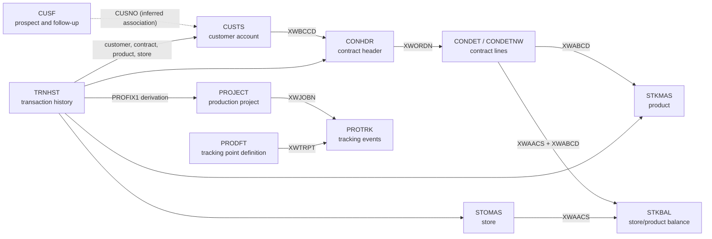
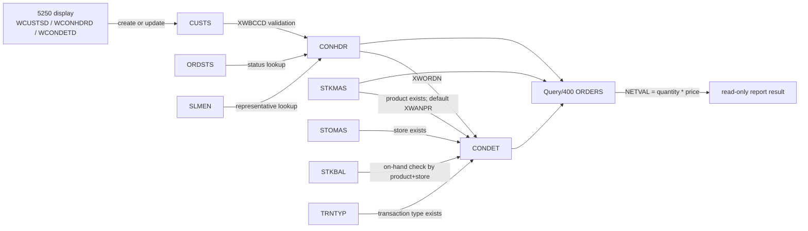
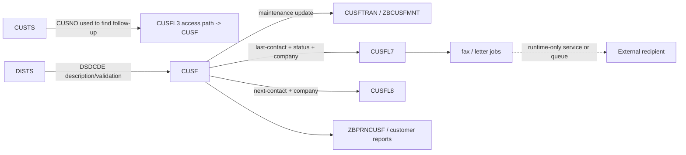
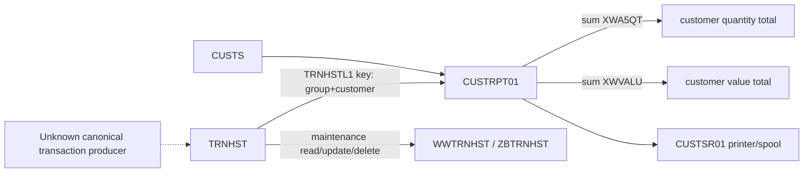
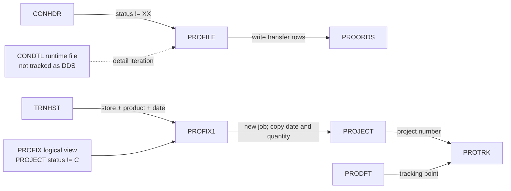

# Domain Model, Data Lineage, and Business Rules

## Baseline, scope, and work contract

This report records the repository state at commit `0126771` on 2026-07-14. It covers tracked DDS database and access-path members, tracked COBOL copybooks, COBOL/RPG/RPGLE data access, CL transfer/orchestration clues, Query/400 transformations, display/printer transfer boundaries, and the existing narrative rule documents. It does not claim which members are compiled, deployed, scheduled, or authoritative at runtime.

The delivery contract is documentation-only: recover the domain model, record shapes, lineage, and business policy without changing production members; keep IBM i mechanics separate from policy; omit record values and secrets; and turn unsupported conclusions into explicit Unknowns with the evidence needed to resolve them. The repository-wide inventory and tooling limitations remain defined by [`00-evidence-map.md`](00-evidence-map.md).

Terminology is normalized as follows: **contract** names the persisted `CONHDR`/`CONDET` model and maintenance flows; **order** is retained for Query/400 `ORDERS`, `ORDAUDIT*`, and other literal source/report labels. Neither term implies a separate table or deployed service. Operational handling of these records is bounded by [`40-operations-and-recovery.md`](40-operations-and-recovery.md).

### Evidence convention

- **Fact** — directly observable in the cited tracked source member.
- **Inference** — a business interpretation supported by cited facts but not explicitly declared as policy or runtime truth.
- **Unknown** — the repository cannot settle the claim; the exact next evidence is named.

Paths and line ranges refer to the baseline above. Generated DDS copybooks, compile listings, IBM i object metadata, database constraints, job schedules, and runtime traces are absent unless explicitly noted.

## Domain glossary and concept map

| Concept | Evidence-led meaning | Status and primary evidence |
| --- | --- | --- |
| Customer account | Debtor/customer identity keyed by `CUSTS.XWBCCD`, with account relationships, tax/bank identifiers, commercial terms, credit exposure, ageing buckets, salesperson, distributor, group, and an optional prospect number. | **Fact:** `QDDSSRC/CUSTS.PF:1-85`. **Inference:** `XWB2CD` and `XWB3CD` form account relationships, but no referential constraint is tracked. |
| Prospect / follow-up | Contact and follow-up record in `CUSF`, reached by company, prospect number, status, distributor, contact dates, product/list codes, salesperson, verifier, organisation, fax, or name through `CUSFL*` access paths. | **Fact:** `QDDSSRC/CUSF.PF:1-69`, `QDDSSRC/CUSFL1.LF`, `CUSFL2.LF`, `CUSFL3.LF`, `CUSFL5.LF`, `CUSFL7.LF`, `CUSFL8.LF`, `CUSFLA.LF`, `CUSFLC.LF`, `CUSFLD.LF`, `CUSFLE.LF`. |
| Customer group / distributor / salesperson | Reference records used to validate or describe customer and contract assignments. | **Fact:** `QDDSSRC/CUSGRP.PF`, `DISTS.PF`, `SLMEN.PF`; lookups in `QRPGLESRC/WWCUSTS.RPGLE:234-254` and `QCBLSRC/ZBCONHDR.CBL:686-717`. |
| Contract header | Contract identity and customer-facing attributes: contract number, debtor, customer reference/date/status, representative, value, and delivery address. | **Fact:** `QDDSSRC/CONHDR.PF:1-20`. |
| Contract detail | Product/store line belonging to a contract, with reference, transaction type, quantity, unit, and price. | **Fact:** `QDDSSRC/CONDET.PF:1-24`. `CONDETNW` has the same format/key and adds SQL-style aliases: `QDDSSRC/CONDETNW.PF:1-32`. |
| Product / store / stock balance | Product master and retail price (`STKMAS`), store master (`STOMAS`), and per-product/per-store on-hand, purchase-order, sales-order, and production balances (`STKBAL`). | **Fact:** `QDDSSRC/STKMAS.PF`, `STOMAS.PF`, `STKBAL.PF`. |
| Transaction history | Period/date/sequence-keyed transaction facts carrying customer/group/area/representative, product/store/groups, document and contract references, transaction type, quantity, and value. | **Fact:** `QDDSSRC/TRNHST.PF:1-37`. |
| Project / production tracking | Project header derived from transaction/order facts, tracking events per project/sequence, tracking-point definitions, and a profiled-order transfer record. | **Fact:** `QDDSSRC/PROJECT.PF`, `PROTRK.PF`, `PRODFT.PF`, `PROORDS.PF`, `QRPGSRC/PROFIX1.RPG`. |
| Reference code | Small keyed vocabulary such as contract status (`ORDSTS`) or transaction type (`TRNTYP`). | **Fact:** `QDDSSRC/ORDSTS.PF`, `TRNTYP.PF`. **Unknown:** allowed code values are data, not tracked schema, except where source sets or compares literals. |
| Logical file | An IBM i access path over a physical record; it changes key order and sometimes selection, not the persistence owner. | **Fact:** representative `PFILE(...)` definitions in `QDDSSRC/CUSTSL1.LF`, `CONDETL2.LF`, `TRNHSTL6.LF`, and `PROFIX.LF`. |
| Display / printer transfer | A workstation or spool record written/read by a program. It transfers or presents fields but is not business persistence. | **Fact:** `QCBLSRC/ZBCONDET.CBL:15-18,79-80`, `ZBPRNCUSF.CBL:13-20,93-143`; `QRPGLESRC/CUSTRPT01.RPGLE:1-4`. |

All solid concept-map joins are **Fact** for shared field shapes and program usage, not proof of database-enforced foreign keys. The dotted `CUSF.CUSNO` relationship is an **Inference** because both `CUSF.CUSNO` and `CUSTS.CUSNO` exist and programs traverse between them, but no tracked constraint declares cardinality.

## Data dictionary

### Persistent records and transfer records

`A` means character, `P` packed decimal, `S` zoned decimal, `L` date, and `T` time as declared in DDS.

| Object / record format | Business purpose and persistence boundary | Key / access | Important fields and DDS shape | Status, sensitivity, and evidence |
| --- | --- | --- | --- | --- |
| `CUSTS` / `CUSTSR` | Customer/account master; physical persistence. | Unique `XWBCCD 11A`. Alternate `CUSTSL1` group+customer, `L2` representative+customer, `L3` prospect+representative, `L4` distributor+customer, `L5` statement-account+customer. | Name `40A`; statement/related account `11A`; tax `15A`; bank transit `9P0`; bank account `15P0`; group `2A`; rep `3A`; distributor `2A`; terms `3A`; credit limit and monetary/ageing values `15P2`; dates `L`; prospect `5P0`. | **Fact:** `QDDSSRC/CUSTS.PF`, `CUSTSL1.LF`-`CUSTSL5.LF`. **Sensitive:** identity, tax, bank, account, credit, balances, ageing, sales/payment values. |
| `CUSF` / `RCUSF` | Prospect/contact/follow-up master; physical persistence. | The PF declares no key. Logical paths include name; status+name; `CUSNO`; distributor/status/name; last-contact/status/name; next-contact/name; product/name; salesperson/name; verifier/name; organisation/name; fax. | Company/contact/title/address/country/postcode; phone/fax/email/web; status `1A`; last/next contact dates `6S0`; customer/organisation `5P0`; comments; document codes; salesperson/verification/audit fields. | **Fact:** `QDDSSRC/CUSF.PF`, `CUSFL1.LF`-`CUSFLE.LF`. **Sensitive:** personal/contact/address/comment/audit-user fields. **Unknown:** PF arrival-key behavior and logical-file uniqueness require DSPFD. |
| `CUSGRP` / `CUSGRPR` | Customer group reference. | Unique group `XWBNCD 2A`. | Description `40A`. | **Fact:** `QDDSSRC/CUSGRP.PF`. The tracked COBOL copybook redefines the description as origin/relationship/service segments; whether that encoding is active policy is **Unknown** (`CPYBKSRC/CUSGRP00.CBLINC`). |
| `DISTS` / `RPRODS` | Distributor/reference list. | `DSDCDE 2A`; alternate `DISTSL1` by description. | Description `34A`. | **Fact:** `QDDSSRC/DISTS.PF`, `DISTSL1.LF`. |
| `SLMEN` / `RSLMEN` | Salesperson/representative lookup. | `PERSON 3A`. | Full name `34A`. | **Fact:** `QDDSSRC/SLMEN.PF`. **Sensitive:** person name and code. |
| `CONHDR` / `CONHDRR` | Contract header; physical persistence. | Unique `XWORDN 6S0`; access by customer+contract/reference/date/rep and date. | Debtor `11A`; customer reference `20A`; date `L`; status `2A`; rep `3A`; value `13S2`; address lines/country/postcode. | **Fact:** `QDDSSRC/CONHDR.PF`, `CONHDRL1.LF`-`CONHDRL5.LF`. **Sensitive:** customer reference and delivery address; contract value is commercial/financial. |
| `CONDET` / `CONDETR` | Contract line; physical persistence. | Unique contract `6S0` + product `20A`; logical paths by store+contract+product, product+store+contract, and product+contract. | Store `11A`; reference `15A`; transaction type `3A`; quantity `9S2`; unit `3A`; price `6S2`. | **Fact:** `QDDSSRC/CONDET.PF`, `CONDETL1.LF`-`CONDETL3.LF`. Commercially sensitive quantities/prices. |
| `CONDETNW` / `CONDETR` | Alias-enhanced alternative line schema; separate physical-file source member. | Same unique contract+product key. | Same physical shapes as `CONDET`; adds `CON_*` aliases. | **Fact:** `QDDSSRC/CONDETNW.PF`. **Unknown:** whether this replaces, coexists with, or merely prototypes `CONDET`; require object/library inventory and compile listings. |
| `ORDSTS` / `STATUSR` | Contract status code reference. | Unique `XWSTAT 2A`. | Description `20A`. | **Fact:** `QDDSSRC/ORDSTS.PF`. **Unknown:** full vocabulary and transition graph require table data and runtime traces. |
| `TRNTYP` / `TRNTYPR` | Transaction-type reference. | Unique `XWRICD 3A`. | Description `20A`. | **Fact:** `QDDSSRC/TRNTYP.PF`. Source default `INV` is documented below; full vocabulary is **Unknown**. |
| `STKMAS` / `STKMASR` | Product master. | Unique product `XWABCD 20A`; alternate group1+group2+group3+product. | Short description `10A`; description `40A`; three group codes `2A`; retail price `11P2`. | **Fact:** `QDDSSRC/STKMAS.PF`, `STKMASL1.LF`. Price is commercially sensitive. |
| `STOMAS` / `STOMASR` | Store master. | Unique store `XWAACS 11A`. | Description `20A`. | **Fact:** `QDDSSRC/STOMAS.PF`. |
| `STKBAL` / `STKBALR` | Product/store stock balances. | Unique product+store; alternate group hierarchy+product and store+product. | Unit `3A`; on-hand, purchase order, sales order, production `13P4`. | **Fact:** `QDDSSRC/STKBAL.PF`, `STKBALL1.LF`, `STKBALL2.LF`. Commercially sensitive inventory. |
| `TRNHST` / `TRNHSTR` | Transaction-history fact. | Unique period `6S0` + date `L` + sequence `11S0`; many logical paths by customer/group/product/store/rep/contract/type/date. | Customer `11A`; group `2A`; delivery area `3A`; rep `3A`; store `11A`; product/groups; document ref `15A`; contract `6S0`; type `3A`; quantity `9S2`; value `13S2`. | **Fact:** `QDDSSRC/TRNHST.PF`, `TRNHSTL1.LF`-`TRNHSTL9.LF`. Customer/document/value data is sensitive. |
| `PROJECT` / `PROJECR` | Production/project header. | Unique project `XWJOBN 6S0`; access by product/project, groups, customer/contract/product, store/product/project, and contract/product/project. | Product `20A`; status `2A` with DDS values `P`, `I`, `C`; planned/actual quantity `13P4`; issue/delivery dates `L`; customer `11A`; contract `6S0`; store `11A`; group `2A`. | **Fact:** `QDDSSRC/PROJECT.PF`, `PROJECL1.LF`-`PROJECL5.LF`. **Inference:** `P/I/C` may mean planned/in-progress/complete; descriptions are not tracked. |
| `PROTRK` / `PROTRKR` | Project tracking events. | Unique project+sequence; alternate tracking-point+planned-date+project+sequence. | Tracking point `11A`; planned date/quantity; actual date/time/quantity; sequence `3S0`. | **Fact:** `QDDSSRC/PROTRK.PF`, `PROTRKL1.LF`. |
| `PRODFT` / `PRODFTR` | Tracking-point definition. | Unique tracking point `11A`. | Sequence `3S0`; description `30A`; lead-time days `3S0`; master flag restricted to `Y`/`N`. | **Fact:** `QDDSSRC/PRODFT.PF`. |
| `PROORDS` / `PROORDR` | Profiled-order transfer/output record, not proven canonical persistence. | No DDS key. | Contract/customer/name/date/status/rep/value, using `XP*` field names. | **Fact:** `QDDSSRC/PROORDS.PF`; written by `QRPGLESRC/PROFILE.RPGLE:1-57`. **Unknown:** lifecycle, consumers, and clearing/refresh semantics need job schedule and DSPFD/object usage. |

### Copybook reconciliation

| Layout | Observed reconciliation | Classification and migration consequence |
| --- | --- | --- |
| `CUSTS00.CBLINC` vs `CUSTS.PF` | Field order and business names broadly correspond. DDS dates are `L`, while the copybook uses `PIC X(10)`. DDS financial fields are `15P2`, while the copybook declares `PIC 9(15)V99`, which appears wider if interpreted literally. | **Fact:** `CPYBKSRC/CUSTS00.CBLINC`, `QDDSSRC/CUSTS.PF`. **Unknown:** IBM i compiler mapping and whether this tracked copybook is compiled. Require generated `DDS-CUSTSR`, compile listing, field offsets, and record length before treating it as binary-compatible. |
| `CUSFL300.CBLINC` vs `CUSF.PF` | The copybook puts `CUSNO` first and then company/contact fields; the PF puts `CUSNO` after address fields. The copybook otherwise resembles the same field set. | **Fact:** `CPYBKSRC/CUSFL300.CBLINC`, `QDDSSRC/CUSF.PF`. **Risk/Unknown:** direct sequential compatibility is not established; programs shown here use compiler-generated `COPY DDS-RCUSF OF CUSFL3`, not this tracked layout. Require generated logical-file copybook and offsets. |
| `CUSGRP00.CBLINC` vs `CUSGRP.PF` | The DDS has one `40A` description; the copybook redefines it as `10A` origin, `5A` relationships, `25A` service details. | **Fact:** `CPYBKSRC/CUSGRP00.CBLINC`, `QDDSSRC/CUSGRP.PF`. **Inference:** a packed semantic convention may exist; no validation proves it. |
| `DISTS00.CBLINC` vs `DISTS.PF` | Code `2A` plus description `34A` align in order and size. | **Fact:** `CPYBKSRC/DISTS00.CBLINC`, `QDDSSRC/DISTS.PF`. Runtime use still requires compile evidence. |

## Producer-consumer and boundary matrix

This matrix names representative major operations; it is not a runtime call graph. `UF`/COBOL rewrite-capable declarations indicate source capability, while a cited `WRITE`, `UPDATE`, `REWRITE`, or `DELETE` proves a concrete operation.

| Record / boundary | Producer or mutator | Consumer / transformation | Operation and boundary | Evidence status |
| --- | --- | --- | --- | --- |
| `CUSTS` | `WWCUSTS` writes/updates customer rows; `ZBCUSTS` is a COBOL maintenance implementation; `OE001`, `OE004`, and `OE008` also write customer-format rows. | Contract, transaction, reporting, and selection programs read it; `CUSTRPT01` pairs it with `TRNHSTL1`. | Physical create/update/read; display transfer through `WCUSTSD`/COBOL display formats. | **Fact:** `QRPGLESRC/WWCUSTS.RPGLE:6-15,331,415`; `QCBLSRC/ZBCUSTS.CBL:15-87`; `QRPGLESRC/CUSTRPT01.RPGLE:1-66`; `QRPGSRC/OE001.RPG:1-5,153-176`. |
| `CUSF` | `CUSFTRAN` updates `RCUSF`; `ZBCUSFMNT` rewrites selected fields; fixed RPG fax/letter utilities update contact/follow-up facts. | `ZBPRNCUSF`, order-entry/customer detail, distribution reports, mail/fax/security-letter flows consume logical paths. | Physical update/read; printer/spool and external fax/letter transfer. | **Fact:** `QRPGLESRC/CUSFTRAN.RPGLE:7-9,178-187`; `QCBLSRC/ZBCUSFMNT.CBL:301-325`; `ZBPRNCUSF.CBL:13-20,99-143`; `QRPGSRC/FAXSHT1.RPG:1-51`. External delivery success is **Unknown**. |
| `CONHDR` | `WWCONHDR` and `ZBCONHDR` create/update/delete; `CON001` and `PUR01` create or update headers. | Detail maintenance, profile extraction, Query/400 `ORDERS`, audits, and customer views read it. | Physical CRUD; logical views by customer/date/rep; screen/report transfer. | **Fact:** `QRPGLESRC/WWCONHDR.RPGLE:7-16,280-541`; `QCBLSRC/ZBCONHDR.CBL:15-100,471-771`; `QRPGSRC/CON001.RPG:145-191`; `QRPGLESRC/PROFILE.RPGLE:6-27`; `QQMQRYSRC/ORDERS:5-14`. |
| `CONDET` | `WWCONDET` creates/updates/deletes lines; `CON001`/`PUR01` write or update lines. | Contract screens, `PROFILE`, Query/400 `ORDERS`, and repair utilities read it. | Physical CRUD; calculated report output `quantity * price`. | **Fact:** `QRPGLESRC/WWCONDET.RPGLE:7-17,270-479`; `QRPGSRC/CON001.RPG:170-191`; `QQMQRYSRC/ORDERS:5-14`. `PROFILE` names untracked `CONDTL`, so its exact binding is **Unknown**. |
| `STKMAS`, `STOMAS`, `STKBAL` | Separate maintenance/operational flows are implied by update-capable programs; this audit does not establish one canonical producer. | Contract validation reads product, store, and balance; Query/400 balance reports join all three; order entry validates against them. | Physical read/validation; report transformation; balance persistence remains owned by `STKBAL`. | **Fact:** `QRPGLESRC/WWCONDET.RPGLE:10-12,377-409`; `QQMQRYSRC/BALANCEPRD`, `BALANCESTO`; `QRPGSRC/PUR01.RPG:3-10,210-230`. Producer ownership is **Unknown**; require DSPPGMREF and job inventory. |
| `TRNHST` | `WWTRNHST` and `ZBTRNHST` expose maintenance including update/delete; upstream transaction generation is not established. | `CUSTRPT01` totals quantity/value by customer group+customer; audits and customer detail use multiple logical paths. | Physical update/delete/read; logical aggregation; printer output. | **Fact:** `QCBLSRC/ZBTRNHST.CBL:23-87,445-493,624-653`; `QRPGLESRC/CUSTRPT01.RPGLE:45-82`. Canonical transaction producer is **Unknown**. |
| `PROJECT` | `PROFIX1` derives projects while reading `TRNHST` and checking `PROFIX` (a non-complete-project access path). | Audit programs and `PROJECL*` views read by product/store/customer/contract/group. | Derived physical write; access-path selection excludes status `C` in `PROFIX`. | **Fact:** `QRPGSRC/PROFIX1.RPG:1-17`; `QDDSSRC/PROFIX.LF`; `PROJECL1.LF`-`PROJECL5.LF`. |
| `PROTRK` / `PRODFT` | No canonical event producer is proven in this repository slice. | `ZAUDPRODFT` counts `PROTRK` by tracking definition; `PROTRKL1` supports schedule order. | Physical tracking persistence and audit/report read. | **Fact:** `QDDSSRC/PROTRK.PF`, `PRODFT.PF`, `PROTRKL1.LF`; `QRPGLESRC/ZAUDPRODFT.RPGLE:9-34`. Producer is **Unknown**. |
| `PROORDS` | `PROFILE` writes one output record per non-`XX` contract detail visited. | No tracked consumer was found in the inspected source. | Derived disk transfer/output; `PROFILE` also writes a printer report. | **Fact:** `QRPGLESRC/PROFILE.RPGLE:1-57`. Consumer and refresh lifecycle are **Unknown**. |
| CL/QTEMP/spool/fax/email | CL programs override files, clear/copy members, call programs, submit jobs, and route output. | Printer programs and external facilities consume temporary/spooled data. | Job-local override, copy, call, spool, or external handoff; not core-table persistence. | **Fact:** `QCLSRC/FAXSHT.CLP`, `FXS1C.CLP`, `WKCUSL.CLP`, `DLYFAXSHT.CLP`, `CUSFMAINTC.CLP`. External queues/services and delivery are **Unknown**. |

## Lineage diagrams

### Customer, contract, detail, and inventory

Every solid edge is **Fact** from `WWCONHDR`, `WWCONDET`, and `QQMQRYSRC/ORDERS`; it proves source-level validation/transformation, not transactionality or enforced referential integrity.

### Customer and follow-up/contact

The CUSF logical keys and program reads/writes are **Fact**. The meaning and success of the external fax/mail edge are **Unknown** pending job logs, queue configuration, and delivery traces.

### Transaction history and reporting

Aggregation and maintenance edges are **Fact** from `QRPGLESRC/CUSTRPT01.RPGLE:45-82` and `QCBLSRC/ZBTRNHST.CBL`. The producer is deliberately **Unknown**.

### Project and production derivation

The `PROFILE`, `PROFIX1`, and DDS edges are **Fact**. The `CONDTL` object and project-to-tracking event producer are **Unknown** because no matching tracked DDS member or event writer was established.

## Business-rule catalog

The “policy” column describes the business effect. Indicator/file-operation details stay in the mechanics column.

| Rule | Policy / invariant | Trigger and outcome | Affected records | Implementation mechanics and evidence | Confidence / next evidence |
| --- | --- | --- | --- | --- | --- |
| BR-01 Contract identity | A contract number must be non-zero and must not collide on add. | Adding a header rejects zero or an already reachable key. | `CONHDR` | COBOL validation in `QCBLSRC/ZBCONHDR.CBL:620-685`; RPG uses keyed `CHAIN/WRITE` in `QRPGLESRC/WWCONHDR.RPGLE`. | **Fact** for implemented validation. Runtime uniqueness also follows DDS `UNIQUE`; confirm object compile with DSPFD. |
| BR-02 Contract references | Customer, status, and representative must resolve before a header is accepted. | Invalid lookup sets an error and blocks the operation. | `CONHDR`, `CUSTS`, `ORDSTS`, `SLMEN` | `QCBLSRC/ZBCONHDR.CBL:686-735`; corresponding `CHAIN`s in `QRPGLESRC/WWCONHDR.RPGLE:598-618`. | **Fact** for these implementations; **Unknown** whether every writer enforces it (`CON001`/`PUR01` do not show equivalent checks in the write routine). |
| BR-03 Header default status | Interactive RPG header addition initializes status to `01`. | New header begins with code `01` before validation. | `CONHDR.XWSTAT` | `QRPGLESRC/WWCONHDR.RPGLE:244`. | **Fact** for that path. Meaning of `01` and whether COBOL/default variants agree require `ORDSTS` data and runtime traces. |
| BR-04 Contract detail defaults | A new interactive detail starts with transaction type `INV`, unit `EAC`, zero quantity, and zero price; valid product selection then defaults price from product retail price. | Add detail; accepted product causes `XWPRIC = STKMAS.XWANPR`. | `CONDET`, `TRNTYP`, `STKMAS` | `QRPGLESRC/WWCONDET.RPGLE:286-322`. | **Fact** for `WWCONDET`; no DDS default exists. Compare all deployed entry points before making a database default. |
| BR-05 Detail validation | Product, store, stock-balance row, transaction type, and unit must be valid; requested quantity must not exceed on-hand. | Validation blocks missing references, quantity `> XWBHQT`, or unit other than `EAC`. | `CONDET`, `STKMAS`, `STOMAS`, `STKBAL`, `TRNTYP` | `QRPGLESRC/WWCONDET.RPGLE:365-430`. | **Fact** for this path. **Risk:** `STKBAL` has `13P4` quantity while contract detail has `9S2`; rounding/conversion behavior needs compile/runtime evidence. |
| BR-06 Line uniqueness | At most one detail exists per contract+product in the declared DDS object. | Duplicate key write fails. | `CONDET`, `CONDETNW` | Unique keys in both DDS members. | **Fact** in source declaration; confirm compiled object and active file with DSPFD. |
| BR-07 Contract deletion | Header and detail programs expose independent deletes. | Confirmed delete removes the selected physical record. | `CONHDR` or `CONDET` | `QCBLSRC/ZBCONHDR.CBL:742-775`; `QRPGLESRC/WWCONDET.RPGLE:270-274`. | **Fact** for source behavior. **Unknown/invariant risk:** no cascade or “no lines” guard is visible; database constraints and runtime tests are required. |
| BR-08 Reported contract net value | Report line net value equals detail quantity multiplied by detail price. | Query result computes `XWA5QT * XWPRIC`. | `CONHDR`, `CONDET`, `STKMAS` | `QQMQRYSRC/ORDERS:5-14`. | **Fact** for Query/400. **Unknown:** rounding/result precision and whether header `XWTAMT` must reconcile to line totals. |
| BR-09 Stock balance reports | Store/product balances are reported only where store and product joins resolve. | Inner joins produce on-hand and purchase-order balances, sorted by product or store. | `STOMAS`, `STKBAL`, `STKMAS` | `QQMQRYSRC/BALANCEPRD`, `BALANCESTO`. | **Fact** for query definitions. Missing-master rows are excluded; whether that is intended policy is **Unknown**. |
| BR-10 Follow-up distribution selection | Distribution lookup uses the prospect’s distributor and active status `A`. | If `CUSFL3` has a distributor, lookup `CUSFL5` by distributor + `A`; return code when found. | `CUSF` | `QRPGLESRC/GETDCODS.RPGLE:39-48`; key order in `QDDSSRC/CUSFL5.LF`. | **Fact** for this helper. Meaning of all other status values is **Unknown**; require code table/data profile. |
| BR-11 Follow-up update | Maintenance rewrites contact identity/address/communication, distributor, salesperson, contact person, salutation, and title; COBOL path intentionally does not update status. | Confirmed maintenance rewrite persists selected fields. | `CUSF` | `QCBLSRC/ZBCUSFMNT.CBL:280-325`, including commented status move; `QRPGLESRC/CUSFTRAN.RPGLE:178-187` does update status and dates. | **Fact** and a material contradiction; deployed entry point and intended ownership need job/menu and runtime evidence. |
| BR-12 Customer transaction totals | For each customer/group key, report totals are sums of transaction quantity and value. Totals print only when both are non-zero. | Traverse `TRNHSTL1`, accumulate, conditionally print. | `TRNHST`, `CUSTS` | `QRPGLESRC/CUSTRPT01.RPGLE:45-82`. | **Fact** for report behavior. The “both non-zero” suppression may hide valid zero-value or zero-quantity activity; business intent is **Unknown**. |
| BR-13 Profile exclusion | Contracts with status `XX` are omitted from profile output. | `PROFILE` skips detail traversal/output for `XWSTAT = 'XX'`. | `CONHDR`, detail object, `PROORDS` | `QRPGLESRC/PROFILE.RPGLE:11-57`. | **Fact** for source. Meaning of `XX`, active schedule, and untracked `CONDTL` binding require `ORDSTS` data, compile listing, and job schedule. |
| BR-14 Project status domain | Project status is limited in DDS to `P`, `I`, or `C`; `PROFIX` excludes `C`. | Only declared values compile into DDS validation; selected access path omits complete (`C`) rows. | `PROJECT` | `QDDSSRC/PROJECT.PF:5-7`, `PROFIX.LF`. | **Fact** for literals; label meanings are **Inference**. Confirm descriptions and transitions with screens, data profile, and runtime traces. |
| BR-15 Project derivation | A transaction can seed a project with a new job number, issue/delivery date equal to transaction date, and planned/actual quantity equal to transaction quantity when no matching non-complete project exists. | `PROFIX1` increments a prior job value and writes `PROJECR` on lookup miss. | `TRNHST`, `PROJECT` | `QRPGSRC/PROFIX1.RPG:1-17`. | **Fact** for mechanics. **Unknown:** how `XXJOBN` is initialized, concurrency safety, status/default fields, and schedule; require compile listing and controlled runtime trace. |
| BR-16 Tracking definition | A tracking point has a sequence, description, lead-time days, and master flag `Y` or `N`; events are unique per project+sequence. | DDS key/value checks reject duplicate event sequence or other master-flag values. | `PRODFT`, `PROTRK` | `QDDSSRC/PRODFT.PF`, `PROTRK.PF`. | **Fact** in DDS source; event-generation policy is **Unknown**. |

## Duplicated and contradictory variants

| Variant family | Reconciled observation | What must not be assumed | Exact next evidence |
| --- | --- | --- | --- |
| COBOL `ZBCON*` vs RPGLE `WWCON*` | Both implement header/detail subfile CRUD and validation against the same DDS families. RPG detail explicitly defaults `INV`/`EAC`/price and enforces on-hand; the inspected COBOL header/detail code shares many validations but is not textually identical. | **Unknown:** which language implementation is authoritative or whether both are reachable. | DSPPGMREF for callers/files, command/menu bindings, object timestamps/signatures, and traces for create/update/delete flows. |
| `CONDET` vs `CONDETNW` | DDS shape/key are the same; `CONDETNW` adds aliases. `ZBCONDETNW` selects database `CONDET` but copies `DD-CONDETR OF CONDETNW`, while `ZBCONDET` uses generated `DDS-CONDETR OF CONDET`. | Do not infer that the “NW” program writes a different physical file or that aliases are deployed. | Compile listings resolving `ASSIGN TO DATABASE-CONDET`, copybooks, object level identifiers, and library/object inventory. |
| Header/detail deletion | Header maintenance deletes `CONHDR`; detail maintenance deletes `CONDET`; no common cascade is visible. | Do not infer referential enforcement or safe orphan handling. | DSPFD constraints/triggers, journal analysis, and deletion runtime trace with before/after child counts. |
| Follow-up COBOL vs RPGLE | `ZBCUSFMNT` leaves status move commented; `CUSFTRAN` updates status plus last/next dates. | Do not combine them into one policy or assume status immutability. | Menu/caller reachability, screen-field mapping, object version, and accepted user-flow trace. |
| `PROFILE` / `CONDTL` vs tracked `CONDET` | `PROFILE` reads file `CONDTL`, but no matching tracked DDS member exists; other contract code uses `CONDET`. | Do not silently rename the dependency in migration specifications. | Compile listing, override/job description, DSPPGMREF, and object inventory for `CONDTL`. |
| `WW*BK`, numbered, `_0/_1/_2`, and COBOL/RPG alternates | Multiple apparent backups or revisions exist for customer/contract flows; source presence and similarity do not establish chronology. | Do not select the newest-looking filename as canonical. | Git/object history, build list, program references, menu/command bindings, and production call traces. |
| Copybook vs DDS | `DISTS00` aligns closely; `CUSTS00` has type/precision questions; `CUSFL300` field order differs from the PF; `CUSGRP00` overlays semantics onto a DDS description. | Do not generate service contracts from tracked copybooks alone. | Compiler-generated copybooks, field offsets/lengths, compile listings, CCSID, and live DSPFFD output. |
| Status/default/calculation variants | Header default `01`, profile exclusion `XX`, follow-up active `A`, project `P/I/C`, transaction default `INV`, unit `EAC`, report `quantity*price`, and conditional totals live in separate paths. | Do not treat literals as a single governed state model or assume descriptions. | Reference-table extracts with masked values, screen/message text, workflow traces, and owner confirmation. |
| Report totals vs header value | Query lines calculate quantity*price; `CONHDR` stores `XWTAMT`; `TRNHST` stores `XWVALU`; no tracked reconciliation rule ties them together. | Do not assume all three values must be equal. | Sample aggregate profiles (masked), posting logic, rounding rules, currency handling, and accounting owner validation. |

## Privacy, secrets, and compliance boundary

- **Fact:** `CUSTS` schema contains tax registration, bank transit/account, credit limit, balance/ageing, sales, payment, and claim values. Treat schema documentation as confidential financial metadata; never reproduce row values.
- **Fact:** `CUSF` contains company/contact names, phone/fax/email/web, postal address, comments, special requirements, salesperson/verifier, and audit usernames/dates. Treat it as personal/contact data; comments and special requirements may contain unstructured sensitive data.
- **Fact:** `CONHDR` contains customer reference, delivery address, and contract value; `TRNHST` contains customer/document references and transaction value. Treat exports, spool files, and screenshots as sensitive.
- **Fact:** this report uses field names, types, and synthetic labels only. It contains no record values, credentials, API keys, or endpoints with secrets.
- **Unknown:** retention, legal basis, access controls, masking, encryption, journaling, and deletion propagation are not established by these sources. Resolve with IBM i authority reports, journal/backup policy, data-classification register, retention policy, and privacy-owner review.

## Unknowns and required next evidence

1. **Active objects and variants — Unknown.** Obtain library/object inventory, object descriptions, module/service-program bindings, DSPPGMREF, menus/commands, and job schedules.
2. **Compiled record contracts — Unknown.** Obtain DSPFFD/DSPFD, generated DDS copybooks, record lengths/offsets, level identifiers, CCSIDs, and compile listings, especially for `CUSFL300`, `CUSTS00`, `CONDETNW`, and `CONDTL`.
3. **Referential integrity and transactions — Unknown.** Inspect constraints, triggers, commitment-control use, journals, and controlled create/update/delete traces across header/detail/customer/stock.
4. **Status vocabularies and transitions — Unknown.** Export masked `ORDSTS`/transaction/follow-up reference values, inspect messages/screens, and trace representative workflows for `01`, `XX`, `A`, `P`, `I`, `C`, and `INV`.
5. **Calculation authority — Unknown.** Reconcile header values, detail quantity*price, transaction values, currencies, scale/rounding, credits/returns, and stock units against masked aggregate profiles and accounting rules.
6. **Producer ownership — Unknown.** Identify canonical writers for `TRNHST`, `STKBAL`, `PROJECT`, `PROTRK`, and the lifecycle/consumer of `PROORDS` using DSPPGMREF, journals, job logs, and scheduler definitions.
7. **External transfer — Unknown.** Confirm spool queues, fax/mail programs, temporary-file cleanup, delivery acknowledgements, and retry/error handling through configuration and job logs.
8. **Data quality/cardinality — Unknown.** Run approved, masked profiles for orphan headers/details, missing master rows, duplicate logical keys, invalid statuses, null/blank conventions, and extreme numeric values. No sample row should enter this repository.

## Migration seams and invariants to preserve

- **Inference:** the safest initial service boundaries follow physical persistence owners (`CUSTS`, `CUSF`, `CONHDR`/`CONDET`, inventory, `TRNHST`, project tracking) while recreating logical files as indexes/views rather than independent entities.
- **Fact:** aliases in `CONDETNW` and human-readable COBOL names provide naming candidates, but the reconciled DDS/compile contract must decide wire types and precision.
- **Fact:** report/query behavior is explicit enough to build characterization datasets: contract `quantity*price`, inventory joins/sorts, and customer transaction quantity/value totals. Use synthetic or masked data only.
- **Unknown:** no migration should encode cascade deletes, state transitions, monetary reconciliation, or project-number allocation until runtime evidence resolves the gaps above.
- The dependency-ordered implementation path is maintained in [`90-modernization-roadmap.md`](90-modernization-roadmap.md); it requires characterization and stabilization before decoupling.
