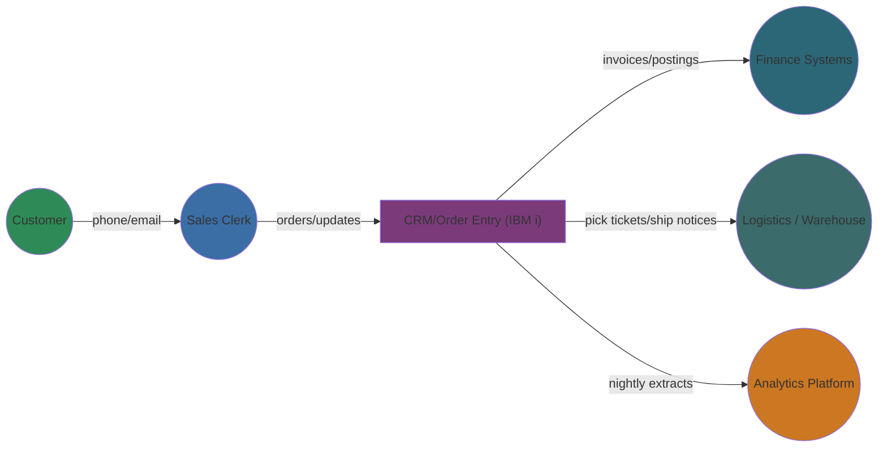
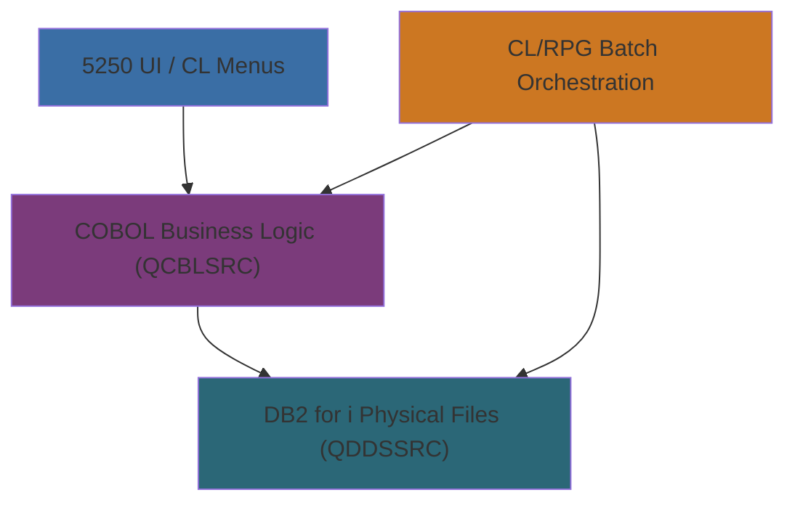
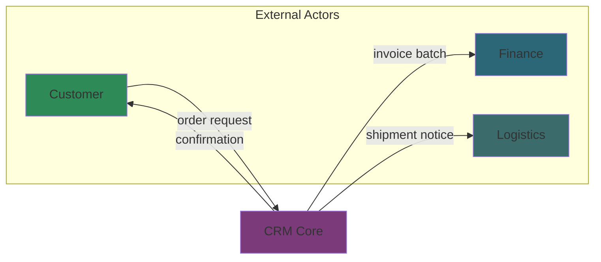
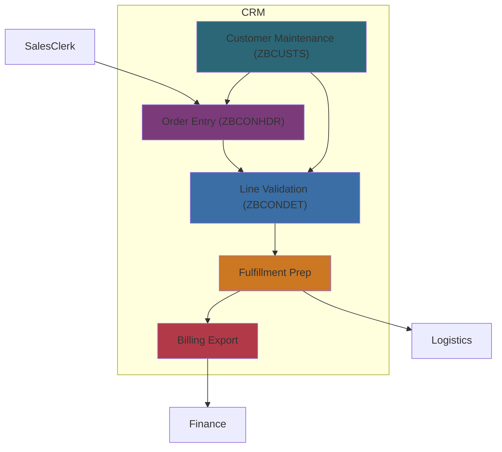
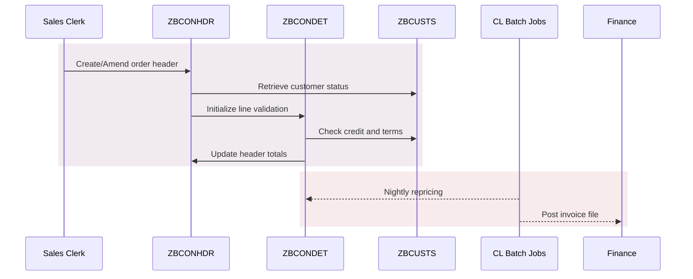
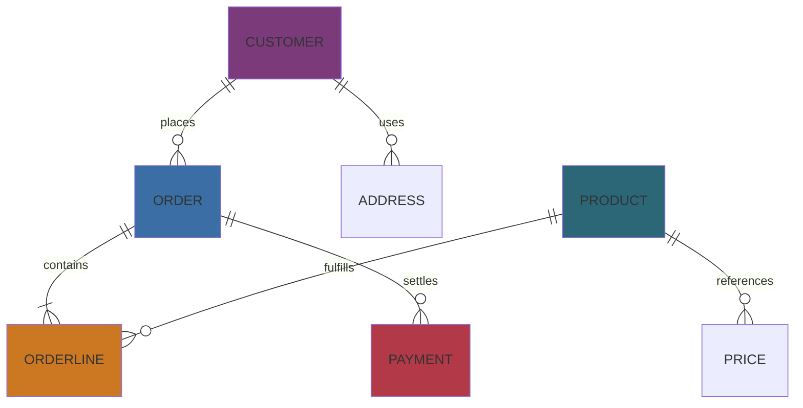

# Architectural Overview

## Purpose and Scope
This document provides a comprehensive architectural overview of the CobolDemo CRM and order management system. It consolidates the structural, behavioral, and data perspectives captured throughout the SSADM documentation into a single view. The goal is to highlight what works well, expose architectural risks, and map the modernization opportunities that future teams can pursue.

## System Context

### Strengths
- Clear separation between human actors and the IBM i core, reducing integration surface area.
- Finance and logistics integrations are handled through asynchronous batch jobs, lowering coupling.
- External analytics receives denormalized extracts, minimizing reporting load on the transactional database.

### Pain Points
- CRM remains a monolith with tightly bound COBOL modules and shared files, limiting independent deployment.
- Integrations depend on flat-file transfers without end-to-end monitoring, increasing operational risk.
- No direct customer self-service channel, forcing all interactions through sales clerks.

## Layered Architecture

**Positive Observations**
- Presentation logic is isolated within CL menus and 5250 screens, keeping COBOL programs focused on business rules.
- DB2 physical files are shared through well-understood DDS definitions, enabling consistent data validation.
- Batch orchestration provides a hook for nightly reconciliation and integration feeds.

**Areas of Concern**
- Batch orchestration triggers business programs via command-line interfaces, making dependency management implicit.
- DDS-defined schema lacks modern referential constraints, permitting data anomalies when jobs fail mid-flight.
- Presentation tier offers limited extensibility for modern UX requirements.

## Data Flow Diagrams

### Level 0 DFD

### Level 1 DFD – Order Lifecycle

## Module Interaction Overview

### Highlights
- Header, detail, and customer modules communicate synchronously during interactive sessions, sharing in-memory state via parameter lists.
- Batch jobs call the same modules using command wrappers, promoting reuse of business rules.

### Risks
- Parameter passing relies on positional fields; errors are hard to detect without automated tests.
- COBOL programs share global files, so one failing job may lock others out.

## Entity Relationship Diagram

**Strengths**
- Core entities (Customer, Order, Order Line) follow standard CRM patterns, easing data warehousing.
- Product and Price separation allows for future catalog integration.

**Weaknesses**
- Missing referential integrity enforcement at the database level.
- Payment records are loosely coupled to orders, making reconciliation scripts necessary.

## Technical Debt Inventory
- **Implicit Data Contracts:** Flat-file exchanges with finance/logistics lack schema versioning. Consider migrating to APIs or at least adding validation steps.
- **Batch Coupling:** Business logic executed via CL commands complicates dependency tracing; introducing a scheduler metadata catalog would improve observability.
- **Testing Gap:** Manual testing dominates. Establishing automated regression tests around ZBCONHDR and ZBCONDET would de-risk modernization.
- **Modernization Opportunity:** Encapsulate COBOL modules behind service APIs to expose self-service functionality without rewriting the core immediately.

## Recommended Next Steps
1. Introduce referential constraints and audit triggers in DB2 to safeguard key relationships.
2. Wrap nightly batch exports in monitored jobs with retry logic and alerting.
3. Pilot an API façade that reuses existing COBOL programs via stored procedures to enable external integrations.
4. Develop a customer portal prototype that consumes the new API layer, reducing manual load on sales clerks.
5. Document configuration and deployment steps for batch jobs to streamline operations handoffs.

