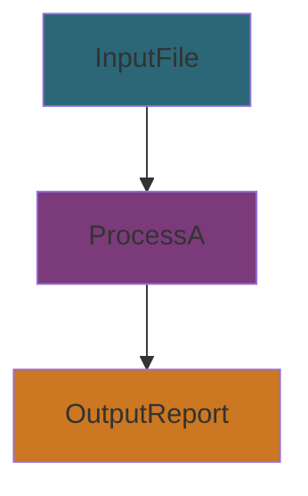
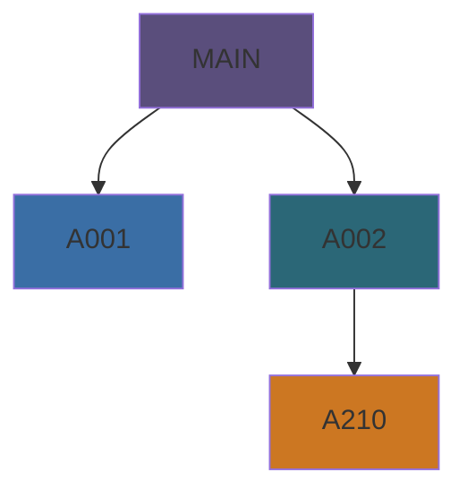
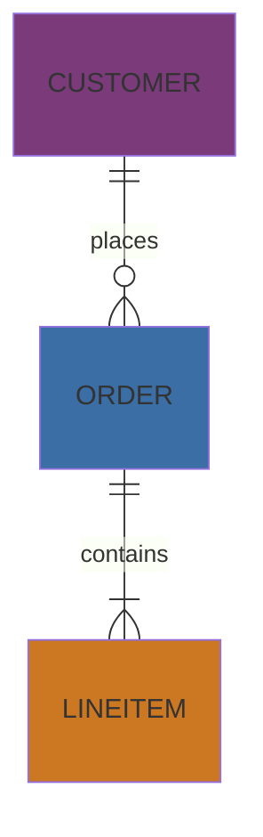
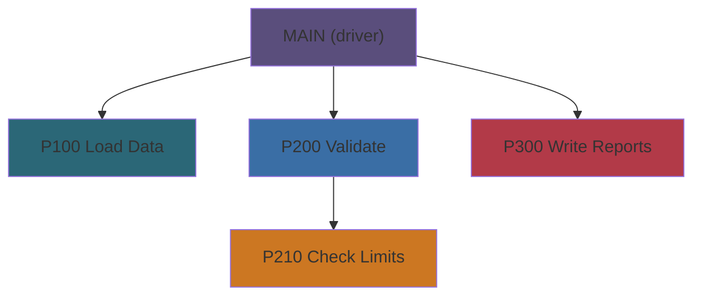

# Prompt: SSADM Documentation Generator for COBOL System

first read ./docs/diagrams.md for diagram conventions.
then read all the context.md files in the entire repo, also analyze module by module, table by table and then document all of your findings in the SSADM format below.

You are an expert in COBOL systems analysis and Structured Systems Analysis and Design Method (SSADM).
You will analyze the provided COBOL repository and generate a complete set of SSADM-style documentation in Markdown format, written for maintainers and system architects.

Follow these steps and conventions:

## 1. Output structure
All generated files go under "./docs/" in Markdown format.

Use this structure:
```
./docs/
  01_system_overview.md
  02_data_model.md
  03_process_model.md
  04_module_specs.md
  05_interfaces.md
  06_physical_design.md
```

## 2. Documentation style
- Use clear, concise technical English.
- Use Markdown headings and lists.
- Use code fences (```cobol, ```jcl, ```json, etc.) for examples.
- Use Mermaid diagrams for all structural and data flow diagrams.

Examples:
Data flow diagram:


Module hierarchy:


## 3. Contents per file

### 01_system_overview.md
- System name and purpose.
- Business context.
- High level architecture summary (main subsystems and dependencies).
- Mermaid system context diagram.
- Key inputs and outputs (files, databases, terminals, APIs).

### 02_data_model.md
- Logical Data Structure (LDS), entities and relationships.
- ER style Mermaid diagram.
- For each entity: purpose, key fields, relationships.
- Data dictionary table with element name, type, source, and description.

Example ER diagram:


### 03_process_model.md
- Data Flow Diagrams (DFDs) for each subsystem.
- List of main processes (programs or modules) and what they do.
- For each process: input data, output data, brief functional description.
- Mermaid flowcharts for each DFD level.

### 04_module_specs.md
Provide one section per COBOL program.
Include:
- Program name
- Description
- Inputs and outputs (files, records, screens)
- Main sections (IDENTIFICATION, ENVIRONMENT, FILE-CONTROL, DATA DIVISION, PROCEDURE DIVISION)
- Key business rules in plain text
- Example code snippets in ```cobol``` blocks
- Optional: control flow or CALL hierarchy in Mermaid

Suggested CALL hierarchy:


### 05_interfaces.md
- List all external interfaces:
  - Batch jobs (JCL)
  - Files exchanged with other systems
  - CICS transactions, APIs, message queues
- Mermaid flow diagrams for external data flows.
- For each interface: protocol or medium, file layout or message schema reference, frequency, direction, error handling summary.

### 06_physical_design.md
- System architecture (batch schedule and job dependencies).
- File organization (VSAM, sequential, indexed).
- Database structure if present.
- Deployment environment (LPARs or regions, subsystems like CICS or IMS, scheduling).
- Mermaid diagram for batch flow or job sequence.

Example batch flow:


## 4. Formatting guidelines
- Use Markdown headings: #, ##, ###.
- Keep explanations short and factual.
- For each diagram or table, include a short caption.
- Use consistent naming taken directly from COBOL and JCL sources.
- Cross link documents where helpful. Example: link module names in 04_module_specs.md to processes in 03_process_model.md.

## 5. Analysis tasks on the COBOL repo
Extract and use the following to infer processes, data flows, and relationships:
- PROGRAM-ID names
- COPYBOOK inclusions (COPY statements)
- ENVIRONMENT DIVISION and CONFIGURATION SECTION details
- FILE-CONTROL and FD sections
- SELECT and ASSIGN clauses for datasets
- CALL statements and USING parameters (for call hierarchy)
- Paragraph names and PERFORM flow
- Data structures from WORKING-STORAGE and LINKAGE
- File I O usage (OPEN, READ, START, WRITE, REWRITE, CLOSE)
- CICS or IMS artifacts if present (EXEC CICS, PSBs, DBDs)
- JCL job steps and PROCs for batch dependencies

## 6. Deliverables
- Produce the full Markdown documentation set under ./docs with all sections linked and internally consistent.
- Add a table of contents at the top of 01_system_overview.md that links to the other documents.
- Where possible, include small but representative code excerpts in ```cobol``` or ```jcl``` blocks.
- Ensure all Mermaid diagrams render without syntax errors.

## 7. Optional repository wide extras
If the repository size allows, also generate:
- A global call graph in Mermaid.
- A data lineage view from input files to output reports.
- A glossary of business terms with references to modules that implement them.

put all of this under ./docs/technical

---

Once all of this is done.
Generate a rich architectural overview of the entire system. include the good, the bad, add data flow diagrams, module diagrams, entity relationship diagrams.

Make it as complete as possible.
put the architectural overview in ./docs/architecture

---

Once this is done.
It´s time to extract all business rules from the entire system.

put this under ./docs/business_rules

use this to extract business rules:
```
You are an expert in COBOL systems analysis and the Structured Systems Analysis and Design Method (SSADM).
Your task is to extract, infer, and document BUSINESS RULES from the provided COBOL source code repository.

### 1. Purpose
Identify and describe all explicit and implicit business rules implemented in the COBOL programs,
using the **classic SSADM structured English format** suitable for inclusion in Markdown documentation.

### 2. Output format
Generate Markdown files under:
```
./docs/business_rules/
```

Each file should correspond to a functional area or COBOL module, for example:
```
./docs/business_rules/AR01_rules.md
./docs/business_rules/INVENTORY_rules.md
```

At the top of each file, include a title and table of contents.

---

### 3. Rule documentation format (Structured English style)

For each business rule, use this exact format:

```
### Rule ID: BR-### (increment sequentially within the file)
**Name:** <short descriptive name>  
**Type:** <Validation | Calculation | Derivation | Decision | Constraint | Exception>  
**Applies To:** <program name, process name, or data entity>  
**Description:**  
IF <condition or trigger>  
THEN <action or result>  
[ELSE <alternative outcome>]  

**Rationale:** <brief business justification>  
**Source:** <copybook, section, or paragraph name if identifiable>  
**Affected Processes:** <list of COBOL programs or modules using this rule>  

**Example:**  
```cobol
IF ACCOUNT-BALANCE < 0
    PERFORM APPLY-OVERDRAFT-FEE
END-IF
```
---
```

### 4. Extraction guidance
Analyze COBOL source code and infer business rules from:
- Conditional logic (`IF`, `EVALUATE`, `PERFORM`, `GO TO`)
- Calculations and data derivations (`COMPUTE`, `MOVE`)
- Validation or constraint logic
- Status or control flags (`88-levels`, condition names)
- Data dependencies across modules
- Error handling routines and messages
- Comments and copybook references that indicate policy or rule intent

Translate these findings into **structured natural language rules** (not raw code).

---

### 5. Style and clarity
- Use **plain structured English**, not pseudocode.
- Avoid implementation details; focus on business meaning.
- Group rules logically (by program or functional area).
- Keep each rule self-contained and easy to read.
- Use Markdown headings and bullet lists where appropriate.

---

### 6. Example output

Example output for `AR001 - Invoice Processing`:

```markdown
# Business Rules — AR001 Invoice Processing

### Rule ID: BR-001
**Name:** Credit Limit Check  
**Type:** Validation  
**Applies To:** CUSTOMER, ORDER  
**Description:**  
IF Customer.CreditLimit < Order.TotalAmount  
THEN Reject the order and display "Credit limit exceeded"  

**Rationale:** Prevent orders that exceed approved credit limits.  
**Source:** Program AR001, paragraph VALIDATE-ORDER.  
**Affected Processes:** AR001, AR002.  

**Example:**  
```cobol
IF ORDER-AMOUNT > CUSTOMER-LIMIT
    MOVE 'LIMIT EXCEEDED' TO ERROR-MESSAGE
END-IF
```

---

### Rule ID: BR-002
**Name:** Invoice Date Derivation  
**Type:** Derivation  
**Applies To:** INVOICE  
**Description:**  
IF InvoiceDate is not provided  
THEN set InvoiceDate = SystemDate  

**Rationale:** Ensure invoices always have a posting date.  
**Source:** AR001, INIT-INVOICE-DATA  
**Affected Processes:** AR001  
```

---

### 7. Deliverable
Produce one `.md` file per major COBOL module, containing all identified rules formatted exactly as above.
Each file must start with a header:
```
# Business Rules — <system or module name>
Generated using SSADM Structured Natural Language format.
```
Include internal Markdown links (`[BR-001](#rule-id-br-001)`) for navigation within the file.
```


