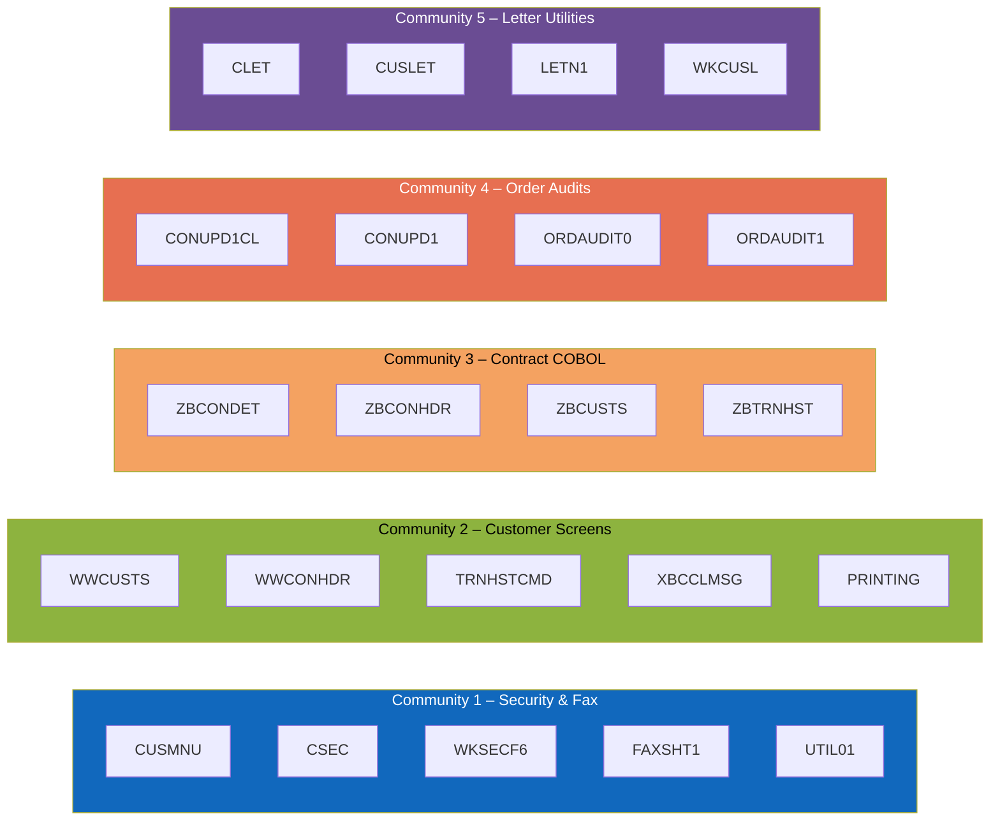

# Graph-based clustering of IBM i modules

## Methodology
- Parsed IBM i source members across COBOL, RPG, CL, DDS, SQL, and command libraries to build a directed dependency graph.
- Extracted edges from CALL, CALLP, and program invocation statements plus COPY/INCLUDE directives to link programs to their collaborators.
- Ran Louvain community detection (falling back to greedy modularity if unavailable) to discover densely connected groups of modules.
- Captured the workflow in `graph_clustering_analysis.py` so future analysts can regenerate the study as source changes land.【F:docs/graph_clustering_analysis.py†L1-L157】

## Graph metrics
- Nodes: 414 modules
- Edges: 270 dependency references
- Communities discovered: 276
- 258 members are isolated singletons, primarily DDS or table definitions with no explicit CALL/COPY relationships.

| Community | Size | Internal edges | Outbound edges |
|-----------|------|----------------|----------------|
| 1 | 27 | 35 | 4 |
| 2 | 27 | 97 | 3 |
| 3 | 21 | 28 | 17 |
| 4 | 21 | 22 | 5 |
| 5 | 13 | 12 | 3 |
| 6 | 7 | 10 | 2 |
| 7 | 7 | 7 | 1 |
| 8 | 7 | 6 | 0 |
| Singleton total | 258 | — | — |

## Community highlights
### 1. Security menu and fax workflows
Customer security CL programs (`CUSMNU`, `CSEC`, `CSEC2/3`) orchestrate menu actions, spool control, and fax letter dispatches, chaining to helper modules such as `WKSECF6B` for key validation, the `WKSECF6` RPG routine for security file lookups, and fax printers like `FAXSHT1` and `FAXERR*` for outbound communications.【F:QCLSRC/CUSMNU.CLP†L1-L160】【F:QCLSRC/CSEC.CLP†L1-L24】【F:QRPGSRC/WKSECF6.RPG†L1-L160】

### 2. Interactive customer maintenance screens
The richest cluster combines display-driven RPG programs (`WWCUSTS`, `WWCONHDR`, `WWTRNHST`) with CL drivers and message utilities (`TRNHSTCMD`, `XBCCLMSG`), reflecting the interactive subfile UI for customer selection, historical drill-down, and messaging cleanup after screen transitions.【F:QRPGLESRC/WWCUSTS.RPGLE†L6-L156】

### 3. Contract COBOL back office
COBOL programs `ZBCONDET`, `ZBCONHDR`, `ZBCUSTS`, and their batch variants form a community centred on contract detail maintenance, jointly pulling copybook layouts for `CONDET`, `CUSTS`, `STKMAS`, `TRNTYP`, and related DDS display/printer formats to support indexed file IO and reporting.【F:QCBLSRC/ZBCONDET.CBL†L1-L140】

### 4. Order audit and bulk updates
`CONUPD1CL` invokes the free-format RPG routine `CONUPD1` to batch-update CUSTS and CONHDR records, while the `ORDAUDIT*` RPGLE series sweeps STOMAS, CONDET, and STKBAL tables to reconcile distribution quantities—marking an operational cluster responsible for data correction runs.【F:QCLSRC/CONUPD1CL.CLP†L1-L4】【F:QRPGLESRC/CONUPD1.RPGLE†L1-L45】【F:QRPGLESRC/ORDAUDIT1.RPGLE†L9-L88】

### 5. Letter sequencing utilities
Letter management CL programs (`CLET`, `CLETN`, `CUSLET`, `LETN1`) increment letter counters, retrieve customer keys, and call menu-driven generators such as `WKCUSL`, tying together the nightly flyer mail-out tooling captured in this community.【F:QCLSRC/CLET.CLP†L1-L17】

### Long tail of singletons
Most DDS display files and database definitions (e.g., `CON001DF`) appear as isolated communities because they expose layouts without invoking other members, underscoring a documentation opportunity to connect them to their consuming programs.【F:QDDSSRC/CON001DF.DSPF†L1-L89】

## Visual summary

