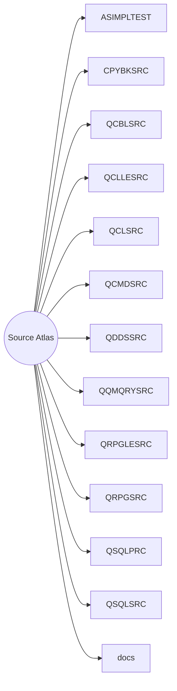

# Source Atlas

An auto-generated map that links every non-Markdown source artifact to the nearest documentation touchpoint. Use it as a launchpad for exploring this IBM i codebase.

## Quick Navigation

## Top-Level Artifacts

- [.project](README.md)
- [CobolDemo-GITST.sln](README.md)

<strong>ASIMPLTEST</strong>

  - [TUTR001.RPG](ASIMPLTEST/context.md)

<strong>CPYBKSRC</strong>

  - [CUSFL300.CBLINC](CPYBKSRC/context.md)
  - [CUSGRP00.CBLINC](CPYBKSRC/context.md)
  - [CUSTS00.CBLINC](CPYBKSRC/context.md)
  - [DISTS00.CBLINC](CPYBKSRC/context.md)

<strong>QCBLSRC</strong>

  - [XACBLTST.CBL](QCBLSRC/context.md)
  - [ZBCONDET.CBL](QCBLSRC/context.md)
  - [ZBCONDETNW.CBL](QCBLSRC/context.md)
  - [ZBCONHDR.CBL](QCBLSRC/context.md)
  - [ZBCUSFMNT.CBL](QCBLSRC/context.md)
  - [ZBCUSTS.CBL](QCBLSRC/context.md)
  - [ZBPRNCUSF.CBL](QCBLSRC/context.md)
  - [ZBTRNHST.CBL](QCBLSRC/context.md)

<strong>QCLLESRC</strong>

  - [TESTWIMX.CLLE](QCLLESRC/context.md)

<strong>QCLSRC</strong>

  - [CBC110.CLP](QCLSRC/context.md)
  - [CLET.CLP](QCLSRC/context.md)
  - [CLETN.CLP](QCLSRC/context.md)
  - [CONUPD1CL.CLP](QCLSRC/context.md)
  - [CSEC.CLP](QCLSRC/context.md)
  - [CSEC2.CLP](QCLSRC/context.md)
  - [CSEC3.CLP](QCLSRC/context.md)
  - [CUSFMAINTC.CLP](QCLSRC/context.md)
  - [CUSINIT.CLP](QCLSRC/context.md)
  - [CUSLET.CLP](QCLSRC/context.md)
  - [CUSLET1.CLP](QCLSRC/context.md)
  - [CUSLIBS.CLP](QCLSRC/context.md)
  - [CUSMNU.CLP](QCLSRC/context.md)
  - [DLYFAXSHT.CLP](QCLSRC/context.md)
  - [FAXSHT.CLP](QCLSRC/context.md)
  - [FXS1C.CLP](QCLSRC/context.md)
  - [FXS3C.CLP](QCLSRC/context.md)
  - [OEMENU.CLP](QCLSRC/context.md)
  - [ORDAUDIT00.CLP](QCLSRC/context.md)
  - [ORDAUDIT01.CLP](QCLSRC/context.md)
  - [ORDAUDIT02.CLP](QCLSRC/context.md)
  - [RTNMSGTEXT.CLLE](QCLSRC/context.md)
  - [SECFOCLP.CLP](QCLSRC/context.md)
  - [TRNCLPCMD.CLLE](QCLSRC/context.md)
  - [TRNHSTCLP.CLLE](QCLSRC/context.md)
  - [WKCUSL.CLP](QCLSRC/context.md)
  - [WKCUSLC.CLP](QCLSRC/context.md)
  - [WKCUSLV.CLP](QCLSRC/context.md)
  - [WKSECF6B.CLP](QCLSRC/context.md)
  - [WKSECF6B2.CLP](QCLSRC/context.md)
  - [WKSECF6B3.CLP](QCLSRC/context.md)
  - [WKSECFC.CLP](QCLSRC/context.md)
  - [WWCCONSC.CLP](QCLSRC/context.md)
  - [WWRAREASC.CLP](QCLSRC/context.md)
  - [XAN4CDEMIZ.CLP](QCLSRC/context.md)
  - [XAN4CDEMNW.CLP](QCLSRC/context.md)
  - [XASYSOPR.CLP](QCLSRC/context.md)
  - [XBCCLMSG.CLP](QCLSRC/context.md)
  - [XBCSNMSG.CLLE](QCLSRC/context.md)
  - [XMCSNMSG.CLP](QCLSRC/context.md)
  - [XTBATCH1.CLLE](QCLSRC/context.md)

<strong>QCMDSRC</strong>

  - [ORDAUDIT0.CMD](QCMDSRC/context.md)
  - [ORDAUDIT1.CMD](QCMDSRC/context.md)
  - [ORDAUDIT2.CMD](QCMDSRC/context.md)
  - [ORDERAUDIT.CMD](QCMDSRC/context.md)
  - [TRNHSTCMD.CMD](QCMDSRC/context.md)

<strong>QDDSSRC</strong>

  - [ASTATUS.PF](QDDSSRC/context.md)
  - [ASTATUSL1.LF](QDDSSRC/context.md)
  - [CB906RD.DSPF](QDDSSRC/context.md)
  - [CBCUSTSD.DSPF](QDDSSRC/context.md)
  - [CNTACS.PF](QDDSSRC/context.md)
  - [CNTCMAINTD.DSPF](QDDSSRC/context.md)
  - [CNTLF1.LF](QDDSSRC/context.md)
  - [CNTLF2.LF](QDDSSRC/context.md)
  - [CNTLF3.LF](QDDSSRC/context.md)
  - [CNTLF4.LF](QDDSSRC/context.md)
  - [CON001DF.DSPF](QDDSSRC/context.md)
  - [CONDET.PF](QDDSSRC/context.md)
  - [CONDETL1.LF](QDDSSRC/context.md)
  - [CONDETL2.LF](QDDSSRC/context.md)
  - [CONDETL3.LF](QDDSSRC/context.md)
  - [CONDETNW.PF](QDDSSRC/context.md)
  - [CONHDR.PF](QDDSSRC/context.md)
  - [CONHDRL1.LF](QDDSSRC/context.md)
  - [CONHDRL1A.LF](QDDSSRC/context.md)
  - [CONHDRL2.LF](QDDSSRC/context.md)
  - [CONHDRL3.LF](QDDSSRC/context.md)
  - [CONHDRL4.LF](QDDSSRC/context.md)
  - [CONHDRL5.LF](QDDSSRC/context.md)
  - [CUSF.PF](QDDSSRC/context.md)
  - [CUSFL1.LF](QDDSSRC/context.md)
  - [CUSFL2.LF](QDDSSRC/context.md)
  - [CUSFL3.LF](QDDSSRC/context.md)
  - [CUSFL5.LF](QDDSSRC/context.md)
  - [CUSFL6.LF](QDDSSRC/context.md)
  - [CUSFL7.LF](QDDSSRC/context.md)
  - [CUSFL8.LF](QDDSSRC/context.md)
  - [CUSFL9.LF](QDDSSRC/context.md)
  - [CUSFLA.LF](QDDSSRC/context.md)
  - [CUSFLB.LF](QDDSSRC/context.md)
  - [CUSFLC.LF](QDDSSRC/context.md)
  - [CUSFLD.LF](QDDSSRC/context.md)
  - [CUSFLE.LF](QDDSSRC/context.md)
  - [CUSFMAINTD.DSPF](QDDSSRC/context.md)
  - [CUSFMOLDD.DSPF](QDDSSRC/context.md)
  - [CUSFSELD.DSPF](QDDSSRC/context.md)
  - [CUSFTRAND.DSPF](QDDSSRC/context.md)
  - [CUSGRP.PF](QDDSSRC/context.md)
  - [CUSGRSLD.DSPF](QDDSSRC/context.md)
  - [CUSMNUDF.DSPF](QDDSSRC/context.md)
  - [CUSTMNT1FM.DSPF](QDDSSRC/context.md)
  - [CUSTMN_1FM.DSPF](QDDSSRC/context.md)
  - [CUSTS.PF](QDDSSRC/context.md)
  - [CUSTSELD.DSPF](QDDSSRC/context.md)
  - [CUSTSL1.LF](QDDSSRC/context.md)
  - [CUSTSL2.LF](QDDSSRC/context.md)
  - [CUSTSL3.LF](QDDSSRC/context.md)
  - [CUSTSL4.LF](QDDSSRC/context.md)
  - [CUSTSL5.LF](QDDSSRC/context.md)
  - [CUSTSO.PF](QDDSSRC/context.md)
  - [CUSTSR01.PRTF](QDDSSRC/context.md)
  - [CUSTSR02.PRTF](QDDSSRC/context.md)
  - [DELIVA.PF](QDDSSRC/context.md)
  - [DELIVAL1.LF](QDDSSRC/context.md)
  - [DEMODBF.PF](QDDSSRC/context.md)
  - [DEVENDRA2.DSPF](QDDSSRC/context.md)
  - [DISTS.PF](QDDSSRC/context.md)
  - [DISTSL1.LF](QDDSSRC/context.md)
  - [DISTSSLD.DSPF](QDDSSRC/context.md)
  - [DSPDISTSD.DSPF](QDDSSRC/context.md)
  - [DSPF01.DSPF](QDDSSRC/context.md)
  - [DSPF2.DSPF](QDDSSRC/context.md)
  - [DSPF3.DSPF](QDDSSRC/context.md)
  - [DSPF4.DSPF](QDDSSRC/context.md)
  - [DSPF5.DSPF](QDDSSRC/context.md)
  - [DSPPTYPESD.DSPF](QDDSSRC/context.md)
  - [GENTAB.PF](QDDSSRC/context.md)
  - [ITEMS.PF](QDDSSRC/context.md)
  - [ITEMSL1.LF](QDDSSRC/context.md)
  - [JCPDSC.PF](QDDSSRC/context.md)
  - [LISTS.PF](QDDSSRC/context.md)
  - [NAMESIDX.PF](QDDSSRC/context.md)
  - [OE001DF.DSPF](QDDSSRC/context.md)
  - [OE002DF.DSPF](QDDSSRC/context.md)
  - [OE003DF.DSPF](QDDSSRC/context.md)
  - [OE004DF.DSPF](QDDSSRC/context.md)
  - [OE006RT.PRTF](QDDSSRC/context.md)
  - [OEMENUDF.DSPF](QDDSSRC/context.md)
  - [ORDBALDTL.LF](QDDSSRC/context.md)
  - [ORDBALRPT.PRTF](QDDSSRC/context.md)
  - [ORDERS](QDDSSRC/context.md)
  - [ORDSTS.PF](QDDSSRC/context.md)
  - [ORDSTSLD.DSPF](QDDSSRC/context.md)
  - [ORGMNTD.DSPF](QDDSSRC/context.md)
  - [ORGS.PF](QDDSSRC/context.md)
  - [ORGSL1.LF](QDDSSRC/context.md)
  - [PF1WNOKYS.PF](QDDSSRC/context.md)
  - [PF2WNOKYS.PF](QDDSSRC/context.md)
  - [PF3WNOKYL1.LF](QDDSSRC/context.md)
  - [PF3WNOKYS.PF](QDDSSRC/context.md)
  - [PF4WNOKYL2.LF](QDDSSRC/context.md)
  - [PF4WNOKYS.PF](QDDSSRC/context.md)
  - [PF5WNOKYS.PF](QDDSSRC/context.md)
  - [PRDBALDTL.LF](QDDSSRC/context.md)
  - [PRDBALRPT.PRTF](QDDSSRC/context.md)
  - [PRODFT.PF](QDDSSRC/context.md)
  - [PROFIX.LF](QDDSSRC/context.md)
  - [PROJECL1.LF](QDDSSRC/context.md)
  - [PROJECL1A.LF](QDDSSRC/context.md)
  - [PROJECL1B.LF](QDDSSRC/context.md)
  - [PROJECL2.LF](QDDSSRC/context.md)
  - [PROJECL3.LF](QDDSSRC/context.md)
  - [PROJECL4.LF](QDDSSRC/context.md)
  - [PROJECL4A.LF](QDDSSRC/context.md)
  - [PROJECL5.LF](QDDSSRC/context.md)
  - [PROJECL5A.LF](QDDSSRC/context.md)
  - [PROJECT.PF](QDDSSRC/context.md)
  - [PROORDS.PF](QDDSSRC/context.md)
  - [PROTRK.PF](QDDSSRC/context.md)
  - [PROTRKL1.LF](QDDSSRC/context.md)
  - [PRTWCUSTPD.DSPF](QDDSSRC/context.md)
  - [PTYPES.PF](QDDSSRC/context.md)
  - [PUR01DF.DSPF](QDDSSRC/context.md)
  - [SECF.PF](QDDSSRC/context.md)
  - [SECFL1.LF](QDDSSRC/context.md)
  - [SECFL2.LF](QDDSSRC/context.md)
  - [SECFL3.LF](QDDSSRC/context.md)
  - [SLMEN.PF](QDDSSRC/context.md)
  - [SLMNSELD.DSPF](QDDSSRC/context.md)
  - [SLSCND1FM.DSPF](QDDSSRC/context.md)
  - [SMENSELD.DSPF](QDDSSRC/context.md)
  - [SSTLF.LF](QDDSSRC/context.md)
  - [SSTPF.PF](QDDSSRC/context.md)
  - [STKBAL.PF](QDDSSRC/context.md)
  - [STKBALL1.LF](QDDSSRC/context.md)
  - [STKBALL2.LF](QDDSSRC/context.md)
  - [STKGRP1.PF](QDDSSRC/context.md)
  - [STKGRP2.PF](QDDSSRC/context.md)
  - [STKGRP3.PF](QDDSSRC/context.md)
  - [STKMAS.PF](QDDSSRC/context.md)
  - [STKMASL1.LF](QDDSSRC/context.md)
  - [STKMASLD.DSPF](QDDSSRC/context.md)
  - [STOMAS.PF](QDDSSRC/context.md)
  - [STOMASLD.DSPF](QDDSSRC/context.md)
  - [STRBALDTL.LF](QDDSSRC/context.md)
  - [STRBALRPT.PRTF](QDDSSRC/context.md)
  - [SUPNAM.PF](QDDSSRC/context.md)
  - [SUPNAML1.LF](QDDSSRC/context.md)
  - [TRNHST.PF](QDDSSRC/context.md)
  - [TRNHSTL1.LF](QDDSSRC/context.md)
  - [TRNHSTL2.LF](QDDSSRC/context.md)
  - [TRNHSTL2A.LF](QDDSSRC/context.md)
  - [TRNHSTL3.LF](QDDSSRC/context.md)
  - [TRNHSTL3A.LF](QDDSSRC/context.md)
  - [TRNHSTL3B.LF](QDDSSRC/context.md)
  - [TRNHSTL3C.LF](QDDSSRC/context.md)
  - [TRNHSTL4.LF](QDDSSRC/context.md)
  - [TRNHSTL5.LF](QDDSSRC/context.md)
  - [TRNHSTL5A.LF](QDDSSRC/context.md)
  - [TRNHSTL5B.LF](QDDSSRC/context.md)
  - [TRNHSTL5C.LF](QDDSSRC/context.md)
  - [TRNHSTL6.LF](QDDSSRC/context.md)
  - [TRNHSTL7.LF](QDDSSRC/context.md)
  - [TRNHSTL8.LF](QDDSSRC/context.md)
  - [TRNHSTL9.LF](QDDSSRC/context.md)
  - [TRNTPSLD.DSPF](QDDSSRC/context.md)
  - [TRNTYP.PF](QDDSSRC/context.md)
  - [TSTPF1.PF](QDDSSRC/context.md)
  - [TSTPF1L1.LF](QDDSSRC/context.md)
  - [TSTPF1L2.LF](QDDSSRC/context.md)
  - [TSTPF1L3.LF](QDDSSRC/context.md)
  - [TSTPF1L4.LF](QDDSSRC/context.md)
  - [TSTPF2.PF](QDDSSRC/context.md)
  - [TSTPF2L1.LF](QDDSSRC/context.md)
  - [TSTPF2L2.LF](QDDSSRC/context.md)
  - [TSTPF3.PF](QDDSSRC/context.md)
  - [TSTPF3L1.LF](QDDSSRC/context.md)
  - [TSTPF3L2.LF](QDDSSRC/context.md)
  - [TSTPF3L3.LF](QDDSSRC/context.md)
  - [WCONDETD.DSPF](QDDSSRC/context.md)
  - [WCONHDRD.DSPF](QDDSSRC/context.md)
  - [WCUSTRP.PRTF](QDDSSRC/context.md)
  - [WCUSTSD.DSPF](QDDSSRC/context.md)
  - [WCUSTSD2.DSPF](QDDSSRC/context.md)
  - [WCUSTSDA.DSPF](QDDSSRC/context.md)
  - [WCUSTSDARR.DSPF](QDDSSRC/context.md)
  - [WITEMSD.DSPF](QDDSSRC/context.md)
  - [WTRNHSTD.DSPF](QDDSSRC/context.md)
  - [WTRNHSTDBK.DSPF](QDDSSRC/context.md)
  - [WWCCONSD.DSPF](QDDSSRC/context.md)
  - [WWCUSFD.DSPF](QDDSSRC/context.md)
  - [WWRAREASD.DSPF](QDDSSRC/context.md)
  - [XCMMENUDF.DSPF](QDDSSRC/context.md)
  - [XEMPD.PF](QDDSSRC/context.md)
  - [XEMPR.PF](QDDSSRC/context.md)
  - [XFRF.PF](QDDSSRC/context.md)
  - [XPGFNM.PF](QDDSSRC/context.md)

<strong>QQMQRYSRC</strong>

  - [BALANCEPRD](QQMQRYSRC/context.md)
  - [BALANCESTO](QQMQRYSRC/context.md)
  - [ORDERS](QQMQRYSRC/context.md)

<strong>QRPGLESRC</strong>

  - [CL03.CLLE](QRPGLESRC/context.md)
  - [CNTCMAINT.RPGLE](QRPGLESRC/context.md)
  - [CONCATPGM.SQLRPGLE](QRPGLESRC/context.md)
  - [CONUPD0.RPGLE](QRPGLESRC/context.md)
  - [CONUPD1.RPGLE](QRPGLESRC/context.md)
  - [CONUPD2.RPGLE](QRPGLESRC/context.md)
  - [CUSFMAINT.RPGLE](QRPGLESRC/context.md)
  - [CUSFMOLD.RPGLE](QRPGLESRC/context.md)
  - [CUSFSEL.RPGLE](QRPGLESRC/context.md)
  - [CUSFTRAN.RPGLE](QRPGLESRC/context.md)
  - [CUSGRSEL.RPGLE](QRPGLESRC/context.md)
  - [CUSREAD.RPGLE](QRPGLESRC/context.md)
  - [CUSTDTL.RPG](QRPGLESRC/context.md)
  - [CUSTMNT1.RPGLE](QRPGLESRC/context.md)
  - [CUSTMNT1_0.RPGLE](QRPGLESRC/context.md)
  - [CUSTMNT1_1.RPGLE](QRPGLESRC/context.md)
  - [CUSTMNT1_2.RPGLE](QRPGLESRC/context.md)
  - [CUSTRPT01.RPGLE](QRPGLESRC/context.md)
  - [CUSTRPT02.RPGLE](QRPGLESRC/context.md)
  - [CUSTSSEL.RPGLE](QRPGLESRC/context.md)
  - [CUSUPD0.RPGLE](QRPGLESRC/context.md)
  - [CUSUPD1.RPGLE](QRPGLESRC/context.md)
  - [CUSUPD2.RPGLE](QRPGLESRC/context.md)
  - [DELETEENT.SQLRPGLE](QRPGLESRC/context.md)
  - [DISTSSEL.RPGLE](QRPGLESRC/context.md)
  - [DSPDISTS.RPGLE](QRPGLESRC/context.md)
  - [DSPPTYPES.RPGLE](QRPGLESRC/context.md)
  - [GETDCOD.RPGLE](QRPGLESRC/context.md)
  - [GETDCODS.RPGLE](QRPGLESRC/context.md)
  - [INSERTENT.SQLRPGLE](QRPGLESRC/context.md)
  - [MATH152.RPGLE](QRPGLESRC/context.md)
  - [NEWTS2.RPGLE](QRPGLESRC/context.md)
  - [ORDAUDIT0.RPGLE](QRPGLESRC/context.md)
  - [ORDAUDIT1.RPGLE](QRPGLESRC/context.md)
  - [ORDAUDIT2.RPGLE](QRPGLESRC/context.md)
  - [ORDRPTPGM.RPGLE](QRPGLESRC/context.md)
  - [ORDSTSEL.RPGLE](QRPGLESRC/context.md)
  - [PRDRPTPGM.RPGLE](QRPGLESRC/context.md)
  - [PROFILE.RPGLE](QRPGLESRC/context.md)
  - [PRTWCUSTP.RPGLE](QRPGLESRC/context.md)
  - [SLMENSEL.RPGLE](QRPGLESRC/context.md)
  - [SLSCND1.RPGLE](QRPGLESRC/context.md)
  - [SMENSEL.RPGLE](QRPGLESRC/context.md)
  - [SNDEMAIL.RPGLE](QRPGLESRC/context.md)
  - [STKMASEL.RPGLE](QRPGLESRC/context.md)
  - [STOMASEL.RPGLE](QRPGLESRC/context.md)
  - [STRRPTPGM.RPGLE](QRPGLESRC/context.md)
  - [TRIGGER1.RPGLE](QRPGLESRC/context.md)
  - [TRNTPSEL.RPGLE](QRPGLESRC/context.md)
  - [TSTPGM1.SQLRPGLE](QRPGLESRC/context.md)
  - [TSTPGM171.SQLRPGLE](QRPGLESRC/context.md)
  - [TSTPGM172.SQLRPGLE](QRPGLESRC/context.md)
  - [TSTPGM2.SQLRPGLE](QRPGLESRC/context.md)
  - [UPDATEENT.SQLRPGLE](QRPGLESRC/context.md)
  - [WCUSTP.RPGLE](QRPGLESRC/context.md)
  - [WWCCONS.RPGLE](QRPGLESRC/context.md)
  - [WWCONDET.RPGLE](QRPGLESRC/context.md)
  - [WWCONDETBK.RPGLE](QRPGLESRC/context.md)
  - [WWCONHDR.RPGLE](QRPGLESRC/context.md)
  - [WWCUSF.RPGLE](QRPGLESRC/context.md)
  - [WWCUSTS.RPGLE](QRPGLESRC/context.md)
  - [WWCUSTS2.RPGLE](QRPGLESRC/context.md)
  - [WWCUSTSARR.RPGLE](QRPGLESRC/context.md)
  - [WWCUSTSBK.RPGLE](QRPGLESRC/context.md)
  - [WWCUSTSQT.RPGLE](QRPGLESRC/context.md)
  - [WWCUSTS_0.RPGLE](QRPGLESRC/context.md)
  - [WWCUSTS_1.RPGLE](QRPGLESRC/context.md)
  - [WWITEMS.RPGLE](QRPGLESRC/context.md)
  - [WWRAREAS.RPGLE](QRPGLESRC/context.md)
  - [WWTRNHST.RPGLE](QRPGLESRC/context.md)
  - [XCMMENU.RPGLE](QRPGLESRC/context.md)
  - [XRPGM1.RPGLE](QRPGLESRC/context.md)
  - [XRPGM2.RPGLE](QRPGLESRC/context.md)
  - [XRTEST1.RPGLE](QRPGLESRC/context.md)
  - [ZAUDASTATU.RPGLE](QRPGLESRC/context.md)
  - [ZAUDCON.RPGLE](QRPGLESRC/context.md)
  - [ZAUDCUSF.RPGLE](QRPGLESRC/context.md)
  - [ZAUDCUSGRP.RPGLE](QRPGLESRC/context.md)
  - [ZAUDCUSTS.RPGLE](QRPGLESRC/context.md)
  - [ZAUDDELIVA.RPGLE](QRPGLESRC/context.md)
  - [ZAUDDISTS.RPGLE](QRPGLESRC/context.md)
  - [ZAUDLISTS.RPGLE](QRPGLESRC/context.md)
  - [ZAUDORGS.RPGLE](QRPGLESRC/context.md)
  - [ZAUDPRODFT.RPGLE](QRPGLESRC/context.md)
  - [ZAUDPROJEC.RPGLE](QRPGLESRC/context.md)
  - [ZAUDPTYPES.RPGLE](QRPGLESRC/context.md)
  - [ZAUDSLMEN.RPGLE](QRPGLESRC/context.md)
  - [ZAUDSTKBAL.RPGLE](QRPGLESRC/context.md)
  - [ZAUDSTKGP1.RPGLE](QRPGLESRC/context.md)
  - [ZAUDSTKGP2.RPGLE](QRPGLESRC/context.md)
  - [ZAUDSTKGP3.RPGLE](QRPGLESRC/context.md)
  - [ZAUDSTKMAS.RPGLE](QRPGLESRC/context.md)
  - [ZAUDSTOMAS.RPGLE](QRPGLESRC/context.md)

<strong>QRPGSRC</strong>

  - [CB903R.RPG](QRPGSRC/context.md)
  - [CB905R.RPG](QRPGSRC/context.md)
  - [CB906R.RPG](QRPGSRC/context.md)
  - [CB906R@BK.RPG](QRPGSRC/context.md)
  - [CFD211.RPG](QRPGSRC/context.md)
  - [CON001.RPG](QRPGSRC/context.md)
  - [CONFIX1.RPG](QRPGSRC/context.md)
  - [CONFIX2.RPG](QRPGSRC/context.md)
  - [CUSCPY.RPG](QRPGSRC/context.md)
  - [CUSLET1.RPG](QRPGSRC/context.md)
  - [CUSLETSQ.RPG](QRPGSRC/context.md)
  - [CUSMTH.RPG](QRPGSRC/context.md)
  - [CUSMTHB.RPG](QRPGSRC/context.md)
  - [CUSRGZ.RPG](QRPGSRC/context.md)
  - [DEALENT.RPG38](QRPGSRC/context.md)
  - [DREPORT.RPG](QRPGSRC/context.md)
  - [FAXERR1.RPG](QRPGSRC/context.md)
  - [FAXERR2.RPG](QRPGSRC/context.md)
  - [FAXNOS1.RPG](QRPGSRC/context.md)
  - [FAXSHT1.RPG](QRPGSRC/context.md)
  - [GCNTAC1.RPG](QRPGSRC/context.md)
  - [GCUST1.RPG](QRPGSRC/context.md)
  - [GENFILES.RPG](QRPGSRC/context.md)
  - [GENFILES2.RPG](QRPGSRC/context.md)
  - [GENFILES3.RPG](QRPGSRC/context.md)
  - [GENFILES4.RPG](QRPGSRC/context.md)
  - [LETN1.RPG](QRPGSRC/context.md)
  - [NEWOPS.RPG](QRPGSRC/context.md)
  - [OE001.RPG](QRPGSRC/context.md)
  - [OE002.RPG](QRPGSRC/context.md)
  - [OE003.RPG](QRPGSRC/context.md)
  - [OE004.RPG](QRPGSRC/context.md)
  - [OE006.RPG](QRPGSRC/context.md)
  - [OE008.RPG](QRPGSRC/context.md)
  - [ORGMNT.RPG](QRPGSRC/context.md)
  - [ORGMNTUG.RPG](QRPGSRC/context.md)
  - [PRJINZ1.RPG](QRPGSRC/context.md)
  - [PROFIX1.RPG](QRPGSRC/context.md)
  - [PUR01.RPG](QRPGSRC/context.md)
  - [RPG36.RPG36](QRPGSRC/context.md)
  - [SEC1.RPG](QRPGSRC/context.md)
  - [SECFCPY.RPG](QRPGSRC/context.md)
  - [SECFO.RPG](QRPGSRC/context.md)
  - [WKCUS8E.RPG](QRPGSRC/context.md)
  - [WKCUS8EF.RPG](QRPGSRC/context.md)
  - [WKCUS8P.RPG](QRPGSRC/context.md)
  - [WKCUSP.RPG](QRPGSRC/context.md)
  - [WKSECF6.RPG](QRPGSRC/context.md)
  - [XRATE_EURO.RPG](QRPGSRC/context.md)

<strong>QSQLPRC</strong>

  - [CONCATSTR](QSQLPRC/context.md)
  - [SQL_PRC_01](QSQLPRC/context.md)
  - [SQL_PRC_02](QSQLPRC/context.md)
  - [SQL_PRC_03](QSQLPRC/context.md)

<strong>QSQLSRC</strong>

  - [COUNTRY.SQL](QSQLSRC/context.md)
  - [COUNTRYDTA.SQL](QSQLSRC/context.md)

<strong>docs</strong>

  - **migration/**
    - **cobol/**
      - **xacbltst/**
        - [XACBLTST-CLIENT.CBL](docs/migration/cobol/xacbltst/README.md)
    - **dotnet/**
      - **XacbltstConcatService/**
        - **Properties/**
          - [launchSettings.json](docs/migration/dotnet/XacbltstConcatService/README.md)
        - **obj/**
          - **Debug/**
            - **net8.0/**
              - [.NETCoreApp,Version=v8.0.AssemblyAttributes.cs](docs/migration/dotnet/XacbltstConcatService/README.md)
              - [XacbltstConcatService.AssemblyInfo.cs](docs/migration/dotnet/XacbltstConcatService/README.md)
              - [XacbltstConcatService.AssemblyInfoInputs.cache](docs/migration/dotnet/XacbltstConcatService/README.md)
              - [XacbltstConcatService.GeneratedMSBuildEditorConfig.editorconfig](docs/migration/dotnet/XacbltstConcatService/README.md)
              - [XacbltstConcatService.GlobalUsings.g.cs](docs/migration/dotnet/XacbltstConcatService/README.md)
              - [XacbltstConcatService.assets.cache](docs/migration/dotnet/XacbltstConcatService/README.md)
          - [XacbltstConcatService.csproj.nuget.dgspec.json](docs/migration/dotnet/XacbltstConcatService/README.md)
          - [XacbltstConcatService.csproj.nuget.g.props](docs/migration/dotnet/XacbltstConcatService/README.md)
          - [XacbltstConcatService.csproj.nuget.g.targets](docs/migration/dotnet/XacbltstConcatService/README.md)
          - [project.assets.json](docs/migration/dotnet/XacbltstConcatService/README.md)
          - [project.nuget.cache](docs/migration/dotnet/XacbltstConcatService/README.md)
          - [project.packagespec.json](docs/migration/dotnet/XacbltstConcatService/README.md)
          - [rider.project.model.nuget.info](docs/migration/dotnet/XacbltstConcatService/README.md)
          - [rider.project.restore.info](docs/migration/dotnet/XacbltstConcatService/README.md)
        - [Program.cs](docs/migration/dotnet/XacbltstConcatService/README.md)
        - [XacbltstConcatService.csproj](docs/migration/dotnet/XacbltstConcatService/README.md)
        - [appsettings.json](docs/migration/dotnet/XacbltstConcatService/README.md)

